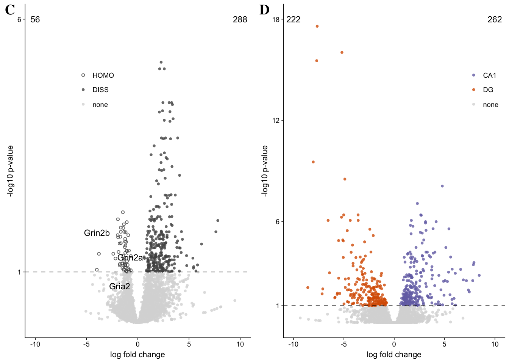

These are the packages I need for my volcano plots.

Here I load the relevant dataframes and set the color palette.

    dissociation <- read.csv("../results/01_dissociation_volcanoTreatment.csv", header = T, row.names = 1)

    dissociation$color <- factor(dissociation$color,
                                 levels = c("HOMO", "DISS", "none"))

    dissociationcolor <-  c("HOMO" = "#525252", "DISS" = "#525252", "none" = "#d9d9d9")

Here's my function for plotting the effect of treatment. Since each
treatment has different levels, I set the color code outside the
function.

    candidates <- dissociation %>%
      dplyr::filter(grepl('Ncs|Nsf|Gria|Grin|Grim|Dlg|Prkc|Camk2|Fmr1|Creb', gene)) %>%
      droplevels()
    candidates <- candidates[,c(1)]
    candidates

    ##  [1] Camk2a  Camk2b  Camk2d  Camk2g  Camk2n1 Camk2n2 Creb1   Creb3  
    ##  [9] Creb3l1 Creb3l2 Crebbp  Crebl2  Crebrf  Crebzf  Dlg1    Dlg2   
    ## [17] Dlg3    Dlg4    Dlg5    Dlgap1  Dlgap2  Dlgap3  Dlgap4  Fmr1   
    ## [25] Gria1   Gria2   Gria3   Gria4   Grin1   Grin2a  Grin2b  Grin2c 
    ## [33] Grin2d  Grin3a  Grina   Ncs1    Ncstn   Nsf     Nsfl1c  Prkca  
    ## [41] Prkcb   Prkcd   Prkcdbp Prkce   Prkcg   Prkci   Prkcq   Prkcsh 
    ## [49] Prkcz  
    ## 49 Levels: Camk2a Camk2b Camk2d Camk2g Camk2n1 Camk2n2 Creb1 ... Prkcz

    VolcanoTreatment <- function(filename, colorval){
      data <- filename
      volcanoplot <- ggplot(data, aes(x = lfc, y = pvalue)) + 
      geom_point(aes(color = factor(color), shape = factor(color)), 
                 size = 1, alpha = 0.8, na.rm = T) + 
    theme_bw(base_size = 8) +
        theme( legend.title = element_blank(),
            legend.position=c(.2,.75),
            panel.grid.minor=element_blank(),
            panel.grid.major=element_blank()) +
      scale_color_manual(values = colorval) +
      scale_x_continuous(name="log fold change",
                          limits = c(-10, 10)) +
      scale_y_continuous(name="-log10 p-value",
                         limits = c(0, 6),
                         breaks = c(1,6)) +
      geom_hline(yintercept = 1,  size = 0.25, linetype = 2 ) + 
      scale_shape_manual(values = c(1,16,16))  +
        
        geom_text_repel(data=filter(dissociation, gene %in% candidates & pvalue>1),
                        aes(label=gene), size = 3,
                        box.padding = unit(0.25, 'lines'),
                        point.padding = unit(0.5, 'lines'))  +
      
        annotate("text", label = "56", x = -10, y = 5.75, size = 3, color = "black") + 
        annotate("text", label = "288", x = 10, y = 5.75, size = 3, color = "black")
      
      plot(volcanoplot)
      
      myfile = paste("../figures/02_volcanoplots/Treatment_", substitute(filename), ".pdf", sep="")
      pdf(file = myfile, width=3, height=3)
      plot(volcanoplot)
      dev.off()
    }

    VolcanoTreatment(dissociation, dissociationcolor)

    ## quartz_off_screen 
    ##                 2

Caption: Differntial gene expression according to treatment is
asymetric, with more genes enrighted in DISS. only 3 canddiate learning
and memory genes identified.

Now this is the fucntion for plotting CA1 vs. DG volcano plots. The
color here is set inside.

    dissociation <- read.csv("../results/01_dissociation_volcanoCA1DG.csv", header = T, row.names = 1)

    VolcanoCA1DG <- function(filename){
      data <- filename
      volcanoplot2 <- ggplot(data, aes(x = lfc, y = pvalue)) + 
      geom_point(aes(color = factor(color), shape = factor(color)), 
                 size = 1, alpha = 0.8, na.rm = T) + 
    theme_bw(base_size = 8) +
      theme(legend.title=element_blank(),
            legend.position=c(.8,.75),
            panel.grid.minor=element_blank(),
            panel.grid.major=element_blank()) + 
        
      scale_color_manual(values = c("CA1" = "#7570b3",
                                    "DG" = "#d95f02", 
                                    "none" = "#d9d9d9")) +   
      scale_x_continuous(name="log fold change",
                         limits = c(-10, 10)) +
      scale_y_continuous(name="-log10 p-value",
                         limits = c(0, 18),
                         breaks = c(1,6,12,18)) +
      geom_hline(yintercept = 1,  size = 0.25, linetype = 2 ) + 
      scale_shape_manual(values = c(16,16,16)) +
      
          annotate("text", label = "222", x = -10, y = 18, size = 3, color = "black") + 
        annotate("text", label = "262", x = 10, y = 18, size = 3, color = "black")
      
      plot(volcanoplot2)
      myfile = paste("../figures/02_volcanoplots/CA1DG_", substitute(filename), ".pdf", sep="")
      pdf(file = myfile, width=3, height=3)
      plot(volcanoplot2)
      dev.off()
    }

    VolcanoCA1DG(dissociation)

    ## quartz_off_screen 
    ##                 2

Build together

    c <- ggdraw() + draw_image("../figures/02_volcanoplots/CA1DG_dissociation.pdf", scale = 1)
    d <- ggdraw() + draw_image("../figures/02_volcanoplots/Treatment_dissociation.pdf", scale = 1)

    cowplot <- plot_grid( c, d,  nrow = 1, rel_widths = c(1, 1),
               labels = c('C', 'D'), align = 'h')

    cowplot

    pdf("../figures/02_volcanoplots/cowplot.pdf", width=6, height=3)
    print(cowplot)
    dev.off()

    ## quartz_off_screen 
    ##                 2

Useful R tutorials
------------------

-   [ggplot axis
    help](http://ggplot2.tidyverse.org/reference/scale_continuous.html)
-   [grepply
    help](http://www.gettinggeneticsdone.com/2016/01/repel-overlapping-text-labels-in-ggplot2.html)
