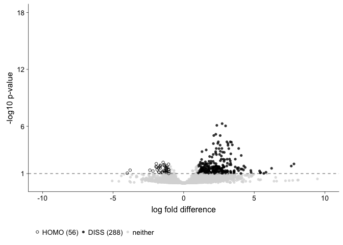
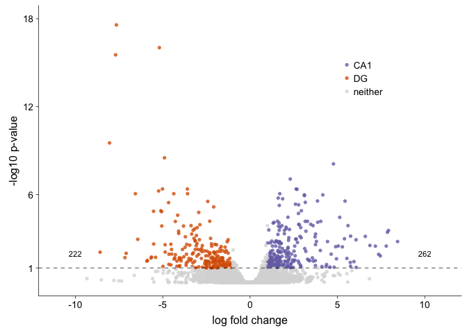
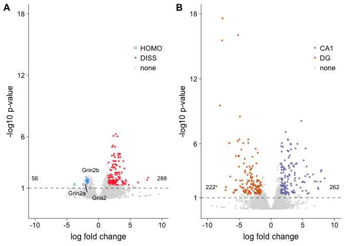

These are the packages I need for my volcano plots.

Here I load the relevant dataframes and set the color palette.

    # dissocation DEGes
    dissociation <- read.csv("../results/01_dissociation_volcanoTreatment.csv", header = T, row.names = 1)

    #set levels
    dissociation$color <- factor(dissociation$color,
                                 levels = c("HOMO", "DISS", "none"))

    #set colors
    dissociationcolor <-  c("HOMO" = "dodgerblue2", "DISS" = "firebrick1", "none" = "#d9d9d9")

    # create list of candidate learning and memory genes
    candidates <- dissociation %>%
      dplyr::filter(grepl('Ncs|Nsf|Gria|Grin|Grim|Dlg|Prkc|Camk2|Fmr1|Creb', gene)) %>%
      droplevels()
    candidates <- candidates[,c(1)]
    candidates

    ##  [1] Camk2a  Camk2b  Camk2d  Camk2g  Camk2n1 Camk2n2 Creb1   Creb3  
    ##  [9] Creb3l1 Creb3l2 Crebbp  Crebl2  Crebrf  Crebzf  Dlg1    Dlg2   
    ## [17] Dlg3    Dlg4    Dlg5    Dlgap1  Dlgap2  Dlgap3  Dlgap4  Fmr1   
    ## [25] Gria1   Gria2   Gria3   Gria4   Grin1   Grin2a  Grin2b  Grin2c 
    ## [33] Grin2d  Grin3a  Grina   Ncs1    Ncstn   Nsf     Nsfl1c  Prkca  
    ## [41] Prkcb   Prkcd   Prkcdbp Prkce   Prkcg   Prkci   Prkcq   Prkcsh 
    ## [49] Prkcz  
    ## 49 Levels: Camk2a Camk2b Camk2d Camk2g Camk2n1 Camk2n2 Creb1 ... Prkcz

    # subfield specific degs
    subfield <- read.csv("../results/01_dissociation_volcanoCA1DG.csv", header = T, row.names = 1)
    head(subfield)

    ##            gene       pvalue        lfc      padj color
    ## 1 0610007P14Rik 0.0075257104 -0.5318386 0.9828207  none
    ## 2 0610009B22Rik 0.0039837752 -0.3593416 0.9908690  none
    ## 3 0610009L18Rik 0.0067001666 -0.6633154 0.9846907  none
    ## 4 0610009O20Rik 0.0107561961 -0.4239904 0.9755371  none
    ## 5 0610010F05Rik 0.0005954242  0.0301684 0.9986299  none
    ## 6 0610010K14Rik 0.0071664863 -0.4609783 0.9836340  none

Plost treatement volcano

    volcanoplot <- ggplot(dissociation, aes(x = lfc, y = pvalue)) + 
      geom_point(aes(color = factor(color), shape = factor(color)), 
                 size = 1, alpha = 0.8, na.rm = T) + 
      theme_cowplot(font_size = 12, line_size = 0.25) +
        theme( legend.title = element_blank(),
            legend.position=c(.7,.75),
            panel.grid.minor=element_blank(),
            panel.grid.major=element_blank()) +
      scale_color_manual(values = dissociationcolor) +
      scale_x_continuous(name="log fold change",
                          limits = c(-10, 10)) +
      scale_y_continuous(name="-log10 p-value",
                         limits = c(-1, 18),
                         breaks = c(1,6,12,18)) +
      geom_hline(yintercept = 1,  size = 0.25, linetype = 2 ) + 
      scale_shape_manual(values = c(1,16,16))  +
        
        geom_text_repel(data=filter(dissociation, gene %in% candidates & pvalue>1),
                        aes(label=gene), size = 3,
                        box.padding = unit(0.25, 'lines'),
                        point.padding = unit(0.5, 'lines'))  +
      
        annotate("text", label = "56", x = -10, y = 2, size = 3, color = "black") + 
        annotate("text", label = "288", x = 10, y = 2, size = 3, color = "black")
    volcanoplot  

    pdf(file = "../figures/02_volcanoplots/Treatment_volcano.pdf", width=2.5, height=2.25)
    plot(volcanoplot)
    dev.off()

    ## quartz_off_screen 
    ##                 2

Caption: Differntial gene expression according to treatment is
asymetric, with more genes enrighted in DISS. only 3 canddiate learning
and memory genes identified.

Plotting CA1 vs. DG volcano plots. The color here is set inside.

    volcanoplot2 <- ggplot(subfield, aes(x = lfc, y = pvalue)) + 
      geom_point(aes(color = factor(color), shape = factor(color)), 
                 size = 1, alpha = 0.8, na.rm = T) + 
      theme_cowplot(font_size = 12, line_size = 0.25) +
      theme(legend.title=element_blank(),
            legend.position=c(.75,.75),
            panel.grid.minor=element_blank(),
            panel.grid.major=element_blank()) + 
      scale_color_manual(values = c("CA1" = "#7570b3",
                                    "DG" = "#d95f02", 
                                    "none" = "#d9d9d9")) +   
      scale_x_continuous(name="log fold change",
                         limits = c(-10, 10)) +
      scale_y_continuous(name="-log10 p-value",
                         limits = c(0, 18),
                         breaks = c(1,6,12,18)) +
      geom_hline(yintercept = 1,  size = 0.25, linetype = 2 ) + 
      scale_shape_manual(values = c(16,16,16)) +
      
          annotate("text", label = "222", x = -9.5, y = 2, size = 3, color = "black") + 
        annotate("text", label = "262", x = 10, y = 2, size = 3, color = "black")
    volcanoplot2 

    pdf(file = "../figures/02_volcanoplots/CA1DG_volcano.pdf", width=2.5, height=2.25)
    plot(volcanoplot2)
    dev.off()

    ## quartz_off_screen 
    ##                 2

    figure2 <- plot_grid(volcanoplot, volcanoplot2,  
                         nrow = 1, labels = c('A', 'B'), 
                         #align = 'h',
                         rel_widths = c(1,1))

    figure2

    pdf("../figures/figure2.pdf", width=5.5, height=3)
    print(figure2)
    dev.off()

    ## quartz_off_screen 
    ##                 2

    ggsave(
      "../figures/figure2.png",
      figure2,
      width = 6,
      height = 3,
      dpi = 1200
    )

Useful R tutorials
------------------

-   [ggplot axis
    help](http://ggplot2.tidyverse.org/reference/scale_continuous.html)
-   [grepply
    help](http://www.gettinggeneticsdone.com/2016/01/repel-overlapping-text-labels-in-ggplot2.html)
