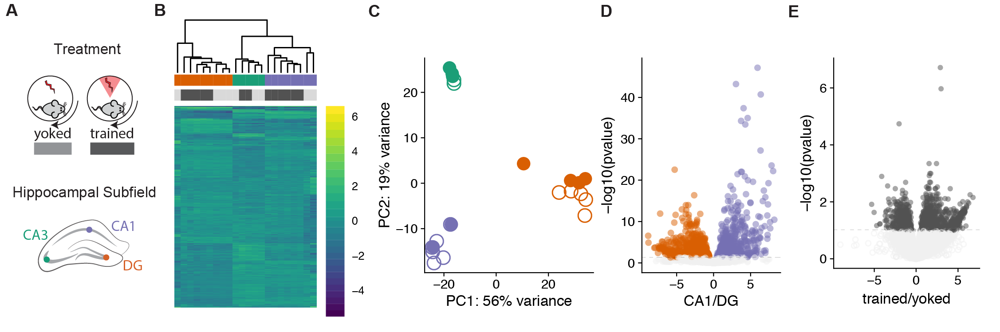

```{r setup, include=FALSE}
#source("http://www.bioconductor.org/biocLite.R")
#biocLite("DESeq2")
library(DESeq2)
library(VennDiagram)
library(genefilter)
library(pheatmap)
library(cowplot)
library(RColorBrewer)
library(dplyr)
library(plyr)
library(ggplot2)
library(edgeR)
library(knitr) 
library(pvclust)
library(viridis)


# set output file for figures 
knitr::opts_chunk$set(fig.path = '../figures/03_cognitiontest/')

# user defined funcitons and options
source("resvalsfunction.R") 
source("DESeqPCAfunction.R")
```

## Examining of cognitive training on hippocampal
The goals of the subsequent analysis are 1) to determine the effects of cognitiving training on hippocampal gene expression and 2) related any detectable changes to variation cause by other technical and biological treatements.

The sample and count information for this part is found in `../data/GSE100225_IntegrativeWT2015ColData.csv` and `../data/GSE100225_IntegrativeWT2015CountData.csv`. You can also download these two files (with a different name but same content) from [GEO GSE100225 ](https://www.ncbi.nlm.nih.gov/geo/query/acc.cgi?acc=GSE100225). 

```{r importdata, include=FALSE}
colData <- read.csv('../data/GSE100225_IntegrativeWT2015ColData.csv')
rownames(colData) <- colData$RNAseqID
countData <-  read.csv('../data/GSE100225_IntegrativeWT2015CountData.csv', check.names = F, row.names = 1)

colData <- colData %>%
  filter(Treatment %in% c("yoked", "trained")) %>% droplevels()

savecols <- as.character(colData$RNAseqID) #selects all good samples
savecols <- as.vector(savecols) # make it a vector
countData <- countData %>% select(one_of(savecols)) # keep good samples

## rename and relevel things
colData$Treatment <- factor(colData$Treatment, levels = c("yoked", "trained"))
```

### Experimental Design
We use 3-4–month-old male C57BL/6J mice fro the Jackson Laboratory and housed at the Marine Biological Laboratory. Mice (N=4) trained in the active place avoidance task are conditioned to avoid mild shocks that can be localized by visual cues in the enviornment. Yoked control mice (N=4) are delivered sequence of unavoidable shock that mimickes the time series of shocks received by the trained mice. While the trained and yoked animals received the same number of shocks, only the trained animals exhibitied an avoidance response. 

Thirty minutes after the last cognitive training session, mice were killed and transverse brain slices were prepared. The DG, CA3, CA1 subregions were microdissected using a 0.25 mm punch (Electron Microscopy Systems) and a dissecting scope (Zeiss). RNA was isolated using the Maxwell 16 LEV RNA Isolation Kit (Promega). RNA libraries were prepared by the Genomic Sequencing and Analysis Facility at the University of Texas at Austin using the Illumina HiSeq platform. 

The orginal design was 4 animals per treament and 3 hippocampal sub regions per animals, which would give 24 samples. After excluding compromized samples, the final sample sizes are: 

```{r viewcoldata, echo=FALSE,message=FALSE, warning=FALSE}
colData %>% select(Treatment,Region)  %>%  summary()
table(colData$Treatment, colData$Region)
```

### Differential gene expresssion analysis

Raw reads were downloaded from the Amazon cloud server to the Stampede Cluster at the Texas Advanced Computing Facility for processing and analysis. RNA quality was checked using the bioinformatic program FASTQC (citation). Low quality reads and adapter sequences were removed using the program Cutadapt (Martin, 2011). Kallisto was use for fast read mapping and counting (Bray et al., 2016). Transcript from a single gene were combined into a count total for each gene. In the end, we meausred the expression of 22,485 genes in 22 samples.

```{r viewscountData, echo=FALSE,message=FALSE, warning=FALSE}
dim(countData)
```

We used DESeq2 (Love et al., 2014) for gene expression normalization and quantification using the following experimental design: `Treatment + Region + Treatment * Region`. Genes with less than 2 counts across all samples were filtered, leaving us with `dim(rld)` genes for analysis of differntial expression.

```{r, include=FALSE}
dds <- DESeqDataSetFromMatrix(countData = countData,
                              colData = colData,
                              design = ~ Treatment + Region + Treatment * Region )
dds <- dds[ rowSums(counts(dds)) > 2, ] ## filter genes with 0 counts
dds <- DESeq(dds) # Differential expression analysis
rld <- rlog(dds, blind=FALSE) # log transform data
```

```{r, echo=TRUE, message=TRUE,comment=FALSE, warning=FALSE}
dim(rld)
```

We identified 423 genes were differentially expressed between the yoked control and cognitively trained animals, 3485 genes that were differentially expressed across subfields, and 324 showed an interaction at FDR p < 0.05 (Fig. 4B). We see a large effect of brain region on gene expression, with 20% of detectable genes begin differentially expressed between one or more brain-region comparisons (3485 differentially expressed genes /17320 measured genes). This is an order of magnitude greater than the 2% of the transcriptome that changed in response to learning (423 DEGs /17320 genes measured).


```{r}
res <- results(dds, contrast =c('Treatment', 'trained', 'yoked'), independentFiltering = T, alpha = 0.1)
summary(res)
table(res$padj<0.1)
head((res[order(res$padj),]), 10)

results <- data.frame(cbind("gene"=row.names(res), 
                         "baseMean" = res$baseMean,
                         "log2FoldChange" = res$log2FoldChange,
                         "lfcSE" = res$lfcSE,
                         "pvalue" = res$pvalue, "padj" = res$padj,
                         "logP"=round(-log(res$pvalue+1e-10,10),1)))
write.csv(results, file = "../results/03_cognition_results.csv", row.names = F)


```

| Contrast | Number of DEGs |
| --- | --- |
| CA1 vs. DG | 2820 |
| CA3 vs. DG | 3014 |
| CA1 vs. CA3 | 2293 |
| CA1 vs. DG | 1283 |

```{r signficiantgenes, include=FALSE}
## DEG by contrasts
contrast1 <- resvals(contrastvector = c('Region', 'CA1', 'DG'), mypval = 0.1) 
contrast2 <- resvals(contrastvector = c('Region', 'CA3', 'DG'), mypval = 0.1)
contrast3 <- resvals(contrastvector = c('Region', 'CA1', 'CA3'), mypval = 0.1) 
contrast4 <- resvals(contrastvector = c('Treatment', 'trained', 'yoked'), mypval = 0.1) 
```

```{r VennDiagramPadj, echo=FALSE}
#create a new DF with the gene counts
rldpvals <- assay(rld)
rldpvals <- cbind(rldpvals, contrast1, contrast2, contrast3, contrast4)
rldpvals <- as.data.frame(rldpvals)
rldpvals <- rldpvals[ , grepl( "padj|pval" , names( rldpvals ) ) ]


# venn with padj values
venn1 <- row.names(rldpvals[rldpvals[2] <0.1 & !is.na(rldpvals[2]),])
venn2 <- row.names(rldpvals[rldpvals[4] <0.1 & !is.na(rldpvals[4]),])
venn3 <- row.names(rldpvals[rldpvals[6] <0.1 & !is.na(rldpvals[6]),])
venn4 <- row.names(rldpvals[rldpvals[8] <0.1 & !is.na(rldpvals[8]),])
venn12 <- union(venn1,venn2)
venn123 <- union(venn12,venn3)

## check order for correctness
candidates <- list("Region" = venn123, "Treatment" = venn4)

prettyvenn <- venn.diagram(
  scaled=T,
  x = candidates, filename=NULL, 
  col = "black",
  fill = c( "white", "white"),
  alpha = 0.5,
  cex = 1, fontfamily = "sans", #fontface = "bold",
  cat.default.pos = "text",
  cat.dist = c(0.08, 0.08), cat.pos = 1,
  cat.cex = 1, cat.fontfamily = "sans")
#dev.off()
grid.draw(prettyvenn)

# save files for big venn diagram
write(venn123, "../results/03_cognition_venn123.txt")
write(venn4, "../results/03_cognition_venn4.txt")
write(venn1, "../results/03_cognition_venn1.txt")
```

```{r VennDiagramPadj2, message=FALSE, warning=FALSE}
candidates <- list("CA1 vs. DG" = venn1, "CA3 vs. DG" = venn2, "CA1 vs. CA3" = venn3)

prettyvenn <- venn.diagram(
  scaled=T,
  x = candidates, filename=NULL, 
  col = "black",
  fill = c( "white", "white", "white"),
  alpha = 0.5,
  cex = 1, fontfamily = "sans", #fontface = "bold",
  cat.default.pos = "text",
  cat.dist = c(0.07, 0.07, 0.07), cat.pos = 1,
  cat.cex = 1, cat.fontfamily = "sans")
#dev.off()
grid.draw(prettyvenn)
```

Hierarchical clustering of the differentially expressed genes separates samples by both subfield and treatment. 

Then, I visuazlied the data as a heatmap showing the relative log fold change of gene expression across samples. Genes were filtered for a minimimum adjust p value < 0.05 in any two-way contrast. The row mean for each gene was subtracted for the raw value to allow for analysis of fold change rather than raw magnitudes. The samples cluster primarily by brain region with some small treatment-driven. 

```{r HeatmapPadj, echo=FALSE, message=TRUE, comment=FALSE, warning=FALSE}
## Any padj <0.05
DEGes <- assay(rld)
DEGes <- cbind(DEGes, contrast1, contrast2, contrast3, contrast4)
DEGes <- as.data.frame(DEGes) # convert matrix to dataframe
DEGes$rownames <- rownames(DEGes)  # add the rownames to the dataframe

DEGes$padjmin <- with(DEGes, pmin(padjTreatmenttrainedyoked, padjRegionCA1DG ,padjRegionCA3DG, padjRegionCA1CA3 )) # put the min pvalue in a new column
DEGes <- DEGes %>% filter(padjmin < 0.1)

rownames(DEGes) <- DEGes$rownames
drop.cols <-colnames(DEGes[,grep("padj|pval|rownames", colnames(DEGes))])
DEGes <- DEGes %>% select(-one_of(drop.cols))
DEGes <- as.matrix(DEGes)
DEGes <- DEGes - rowMeans(DEGes)


# setting color options

ann_colors <- list(Treatment = c(yoked = (values=c("#d9d9d9")),
                                  trained = (values=c("#525252"))),
                        Region = c(CA1 = (values=c("#7570b3")),
                                   CA3 = (values=c("#1b9e77")), 
                                   DG = (values=c("#d95f02"))))

df <- as.data.frame(colData(dds)[,c("Treatment", "Region")])
paletteLength <- 30
myBreaks <- c(seq(min(DEGes), 0, length.out=ceiling(paletteLength/2) + 1), 
              seq(max(DEGes)/paletteLength, max(DEGes), length.out=floor(paletteLength/2)))


pheatmap(DEGes, show_colnames=F, show_rownames = F,
         annotation_col=df, annotation_colors = ann_colors,
         treeheight_row = 0, treeheight_col = 25,
         fontsize = 8, 
         border_color = "grey60" ,
         color = viridis(30),
         clustering_method="average",
         breaks=myBreaks,
         clustering_distance_cols="correlation" 
         )

# for adobe
pheatmap(DEGes, show_colnames=F, show_rownames = F,
         annotation_col=df, annotation_colors = ann_colors,
         treeheight_row = 0, treeheight_col = 25,
         annotation_legend = FALSE,
         annotation_names_row = FALSE, annotation_names_col = FALSE,
         fontsize = 6, 
         width=1.5, height=2.25,
         border_color = "grey60",
         color = viridis(30),
         clustering_method="average",
         breaks=myBreaks,
         clustering_distance_cols="correlation" ,
         filename = "../figures/03_cognitiontest/HeatmapPadj-1.pdf"
         )
```


# volcano plots yea!

```{r volcano}
volcano2 <-  c("trained" = "#525252",
               "yoked" = "#525252",
               "none" = "#f0f0f0")

res <- results(dds, contrast =c('Treatment', 'trained', 'yoked'), independentFiltering = T, alpha = 0.1)
summary(res)
resOrdered <- res[order(res$padj),]
head(resOrdered, 10)

topGene <- rownames(res)[which.min(res$padj)]
plotCounts(dds, gene = topGene, intgroup=c("Treatment"))

data <- data.frame(gene = row.names(res),
                   pvalue = -log10(res$padj), 
                   lfc = res$log2FoldChange)
data <- na.omit(data)

data <- data %>%
  mutate(color = ifelse(data$lfc > 0 & data$pvalue > 1, 
                        yes = "trained", 
                        no = ifelse(data$lfc < 0 & data$pvalue > 1, 
                                    yes = "yoked", 
                                    no = "none")))
data$color <- as.factor(data$color)
summary(data)

volcano <- ggplot(data, aes(x = lfc, y = pvalue)) + 
  geom_point(aes(color = color, shape=color), size = 1, alpha = 0.5, na.rm = T) + 
  scale_color_manual(values = volcano2)  + 
  scale_x_continuous(name="trained/yoked") +
  scale_y_continuous(name="-log10(pvalue)") +
  theme_cowplot(font_size = 8, line_size = 0.25) +
  geom_hline(yintercept = 1,  size = 0.25, linetype = 2 )+ 
  theme(panel.grid.minor=element_blank(),
        legend.position = "none", 
        panel.grid.major=element_blank()) +
  scale_shape_manual(values=c(1, 16, 16)) 
volcano

pdf(file="../figures/03_cognitiontest/volcano1.pdf", width=1.5, height=2)
plot(volcano)
dev.off()


res <- results(dds, contrast =c("Region", "CA1", "DG"), independentFiltering = T, alpha = 0.05)
resOrdered <- res[order(res$padj),]
head(resOrdered, 10)
data <- data.frame(gene = row.names(res), pvalue = -log10(res$padj), lfc = res$log2FoldChange)
data <- na.omit(data)
data <- data %>%
  mutate(color = ifelse(data$lfc > 0 & data$pvalue > 1.3, 
                        yes = "CA1", 
                        no = ifelse(data$lfc < 0 & data$pvalue > 1.3, 
                                    yes = "DG", 
                                    no = "none")))
top_labelled <- top_n(data, n = 5, wt = lfc)

# Color corresponds to fold change directionality
volcano2 <- ggplot(data, aes(x = lfc, y = pvalue)) + 
  geom_point(aes(color = factor(color)), size = 1, alpha = 0.5, na.rm = T) + # add gene points
  scale_color_manual(values = c("CA1" = "#7570b3",
                                "DG" = "#d95f02", 
                                "none" = "#f0f0f0")) + 
  theme_cowplot(font_size = 8, line_size = 0.25) +
  geom_hline(yintercept = 1.3, size = 0.25, linetype = 2) + 
  scale_y_continuous(name="-log10(pvalue)") +
  scale_x_continuous(name="CA1/DG") +
  theme(panel.grid.minor=element_blank(),
        legend.position = "none", 
        panel.grid.major=element_blank()) 
volcano2

pdf(file="../figures/03_cognitiontest/volcano2.pdf", width=1.5, height=2)
plot(volcano2)
dev.off()
```


A principal component analysis of all gene expression data revealed that brain region explains 75% of the variance in the data.  PC1 accounts for 56% of the variance and distinguishes DG from not-DG samples (ANOVA for PC1 ~ Region: F2,19= 226.1; p < 0.001). A post hoc Tukey test showed that DG samples are significantly different from both CA1 and CA3 samples (CA1-DG, p < 0.001; CA3-DG, p < 0.001; CA1-CA3, p = 0.23).  PC2 accounts for 19% of the variance and distinguishes the three subfields (PC2 ~ Region ANOVA: F2,19= 255.3; p < 0.001; Tukey test, p < 0.001for all three comparisons). PC3 are PC4 are influenced by variation due to cognitive training (PC3 ~ Treatment ANOVA: F1,20=7.451; p = 0.012, PC4 ~ Treatment ANOVA: F1,20=10.11; p = 0.0047). An analysis of Gene Ontology identified 91 GO terms at 10% FDR significant. Among the top 10 are glutamate signaling and membrane transport systems and a downregulation of oxidoreductase and ribosomal activity (Fig. 2C). 


```{r PCA, include=FALSE}
colorvalRegion <- c("#7570b3", "#1b9e77", "#d95f02")
colorvalTreatment <- c("#ffffff", "#525252")

pcadata <- pcadataframe(rld, intgroup=c("Treatment", "Region"), returnData=TRUE)
percentVar <- round(100 * attr(pcadata, "percentVar"))

pcadata$Treatment <- factor(pcadata$Treatment, levels = c("yoked", "trained"))

PCA12 <- ggplot(pcadata, aes(PC1, PC2, shape = Treatment, color = Region)) + 
  geom_point(size = 3, alpha = 1) +
    xlab(paste0("PC1: ", percentVar[1],"% variance")) +
    ylab(paste0("PC2: ", percentVar[2],"% variance")) +
    scale_color_manual(values = colorvalRegion) +
    theme_cowplot(font_size = 8, line_size = 0.25)  +
    theme(legend.position="none") +
    scale_shape_manual(values=c(16, 1)) 
PCA12

pdf(file="../figures/03_cognitiontest/PCA-1.pdf", width=1.75, height=2)
plot(PCA12)
dev.off()


```


```{r statistics}
## statistics
aov1R <- aov(PC1 ~ Region, data=pcadata)
summary(aov1R) 
TukeyHSD(aov1R, which = "Region") 

aov2R <- aov(PC2 ~ Region, data=pcadata)
summary(aov2R) 
TukeyHSD(aov2R, which = "Region") 

aov3R <- aov(PC3 ~ Region, data=pcadata)
summary(aov3R) 
TukeyHSD(aov3R, which = "Region") 

aov4R <- aov(PC3 ~ Region, data=pcadata)
summary(aov4R) 
TukeyHSD(aov4R, which = "Region") 

aov5R <- aov(PC5 ~ Region, data=pcadata)
summary(aov5R) 
TukeyHSD(aov5R, which = "Region") 

aov6R <- aov(PC6 ~ Region, data=pcadata)
summary(aov6R) 
TukeyHSD(aov6R, which = "Region") 


aov1T <- aov(PC1 ~ Treatment, data=pcadata)
summary(aov1T) 

aov2T <- aov(PC2 ~ Treatment, data=pcadata)
summary(aov2T) 

aov3T <- aov(PC3 ~ Treatment, data=pcadata)
summary(aov3T) 
 
aov4T <- aov(PC4 ~ Treatment, data=pcadata)
summary(aov4T) 

aov5T <- aov(PC5 ~ Treatment, data=pcadata)
summary(aov5T) 
 
aov6T <- aov(PC6 ~ Treatment, data=pcadata)
summary(aov6T) 
```

The gene expression data were exported to csv files for importing into the GOMMU analysis package for subsequent analysis.

```{r GOsetup}
# from https://github.com/rachelwright8/Ahya-White-Syndromes/blob/master/deseq2_Ahya.R
res <- results(dds, contrast=c('Treatment', 'trained', 'yoked'), independentFiltering = FALSE)
table(res$padj<0.05)

logs <- data.frame(cbind("gene"=row.names(res),"logP"=round(-log(res$pvalue+1e-10,10),1)))
logs$logP <- as.numeric(as.character(logs$logP))
sign <- rep(1,nrow(logs))
sign[res$log2FoldChange<0]=-1  ##change to correct model
table(sign)
logs$logP <- logs$logP*sign

write.csv(logs, file = "./06_GO_MWU/03_behavior_GOpvals.csv", row.names = F)
```


Supplementary figures showing the distibution of pvalues. 

```{r histogram}
myhistogram(contrastvector = c('Region', 'CA1', 'DG'), mypval = 0.1)
myhistogram(contrastvector = c('Region', 'CA3', 'DG'), mypval = 0.1)
myhistogram(contrastvector = c('Region', 'CA1', 'CA3'), mypval = 0.1)
myhistogram(contrastvector = c('Treatment', 'trained', 'yoked'), mypval = 0.1)
```


Here is the corresponding Adobe Illustrator file that combines many of the above plots. 

