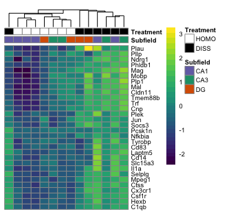

    dissocation_DEGs <- read.csv("../results/heatmap_DEGs.csv", header = T, check.names = F)
    dissocation_df <-read.csv("../results/heatmap_colData.csv", header = T, row.names = 1)
    dissocation_df <- dissocation_df %>% dplyr::select(Subfield, Treatment)
    dissocation_DEGs$rownames <- str_to_upper(dissocation_DEGs$rownames)
    names(dissocation_DEGs)

    ##  [1] "100-CA1-1"             "100-CA1-2"            
    ##  [3] "100-CA1-3"             "100-CA3-1"            
    ##  [5] "100-CA3-4"             "100-DG-2"             
    ##  [7] "100-DG-3"              "101-CA1-1"            
    ##  [9] "101-CA1-2"             "101-CA1-3"            
    ## [11] "101-CA3-1"             "101-CA3-4"            
    ## [13] "101-DG-3"              "101-DG-4"             
    ## [15] "pvalTreatmentDISSHOMO" "padjTreatmentDISSHOMO"
    ## [17] "rownames"              "padjmin"

    head(dissocation_df)

    ##           Subfield Treatment
    ## 100-CA1-1      CA1      HOMO
    ## 100-CA1-2      CA1      HOMO
    ## 100-CA1-3      CA1      HOMO
    ## 100-CA3-1      CA3      HOMO
    ## 100-CA3-4      CA3      HOMO
    ## 100-DG-2        DG      HOMO

Here is the function I wrote to make two heatmaps, one a png and one a
pdf. The goal is to have the ~ top 30 genes that are differentially
expressed according to treatment.

    #colorpalette
    dissocation_colors <- list(Treatment = c(HOMO = (values=c("white")), 
                                             DISS = (values=c("black"))),
                               Subfield = c(CA1 = (values=c("#7570b3")),
                                            CA3 = (values=c("#1b9e77")), 
                                            DG = (values=c("#d95f02"))))

    # heatmap_png and heatmap_pdf usage: DEGs (aka expression matrix), ann_colors, df (aka annotation df), title, clustercolsmethod)

    # figure 2b
    heatmap_png(dissocation_DEGs, dissocation_colors, dissocation_df, " ", "euclidean")

    ##       100-CA1-1 100-CA1-2 100-CA1-3 100-CA3-1 100-CA3-4 100-DG-2 100-DG-3
    ## 15098  6.678939  6.455190  6.585972  8.021705  8.064552 8.194074 7.462165
    ## 6785   6.794036  6.431082  6.271558  6.650496  7.124864 6.557296 6.818165
    ## 12780  4.627409  4.682581  4.402139  4.847265  5.556670 4.942805 4.512461
    ## 1994   5.832386  5.187311  5.270995  5.448558  5.891398 5.629710 5.663644
    ## 3387   7.177887  6.356079  6.475490  7.079482  7.001363 6.618543 6.447274
    ##       101-CA1-1 101-CA1-2 101-CA1-3 101-CA3-1 101-CA3-4 101-DG-3 101-DG-4
    ## 15098  7.907248  9.081181  9.465768  9.667106 10.024008 9.382194 8.450111
    ## 6785   8.542570  8.909306  8.034152  7.697114  8.490398 8.148864 7.514103
    ## 12780  6.646905  6.640343  7.222905  6.352124  6.157990 6.587095 5.288673
    ## 1994   7.258444  7.473619  7.165815  6.501372  7.162034 7.012940 6.493650
    ## 3387   8.356752  8.862487  8.438353  8.129927  8.587689 8.407205 7.361839
    ##       pvalTreatmentDISSHOMO padjTreatmentDISSHOMO rownames      padjmin
    ## 15098          4.371346e-11          5.314245e-07      TRF 5.314245e-07
    ## 6785           1.332342e-10          8.098639e-07     HEXB 8.098639e-07
    ## 12780          2.274266e-10          9.216085e-07   SELPLG 9.216085e-07
    ## 1994           2.325214e-09          7.066907e-06     C1QB 7.066907e-06
    ## 3387           4.728766e-09          9.581268e-06    CSF1R 9.581268e-06

    heatmap_pdf(dissocation_DEGs, dissocation_colors, dissocation_df, " ", "euclidean")

    #correlation heatmap (not used in manuscript)
    heatmap_png(dissocation_DEGs, dissocation_colors, dissocation_df, " ", "correlation")

    ##       100-CA1-1 100-CA1-2 100-CA1-3 100-CA3-1 100-CA3-4 100-DG-2 100-DG-3
    ## 15098  6.678939  6.455190  6.585972  8.021705  8.064552 8.194074 7.462165
    ## 6785   6.794036  6.431082  6.271558  6.650496  7.124864 6.557296 6.818165
    ## 12780  4.627409  4.682581  4.402139  4.847265  5.556670 4.942805 4.512461
    ## 1994   5.832386  5.187311  5.270995  5.448558  5.891398 5.629710 5.663644
    ## 3387   7.177887  6.356079  6.475490  7.079482  7.001363 6.618543 6.447274
    ##       101-CA1-1 101-CA1-2 101-CA1-3 101-CA3-1 101-CA3-4 101-DG-3 101-DG-4
    ## 15098  7.907248  9.081181  9.465768  9.667106 10.024008 9.382194 8.450111
    ## 6785   8.542570  8.909306  8.034152  7.697114  8.490398 8.148864 7.514103
    ## 12780  6.646905  6.640343  7.222905  6.352124  6.157990 6.587095 5.288673
    ## 1994   7.258444  7.473619  7.165815  6.501372  7.162034 7.012940 6.493650
    ## 3387   8.356752  8.862487  8.438353  8.129927  8.587689 8.407205 7.361839
    ##       pvalTreatmentDISSHOMO padjTreatmentDISSHOMO rownames      padjmin
    ## 15098          4.371346e-11          5.314245e-07      TRF 5.314245e-07
    ## 6785           1.332342e-10          8.098639e-07     HEXB 8.098639e-07
    ## 12780          2.274266e-10          9.216085e-07   SELPLG 9.216085e-07
    ## 1994           2.325214e-09          7.066907e-06     C1QB 7.066907e-06
    ## 3387           4.728766e-09          9.581268e-06    CSF1R 9.581268e-06
