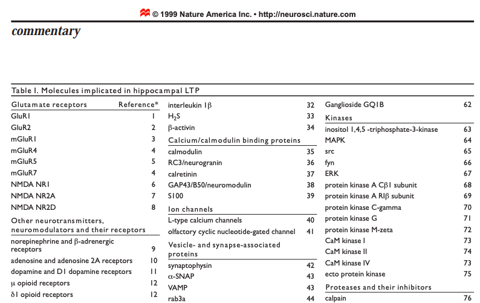

```{r setup, message = F, warning=F, echo = F}
library(readxl)
library(ggplot2)
library(cowplot)
library(dplyr)
library(plyr)
library(stringr) # for sentence to upper case conversion
library(kableExtra) # for pretty tables
# note: won't run if plyr loaded before dplyr

# set output file for figures and general chunk settings
knitr::opts_chunk$set(fig.path = '../figures/04_candidategenes/', echo = T, message = F, warning=F)
```

# Comparing candidate genes lists

The purpose of this script is to determine if there is any overlap in the genes identified as differentially expressed in my study (aka Dissociation test) and other experiments. I compare my data to Sanes and Lichtman 1999 and Cho et a.l 2015 to see if these genes are implicated in long-term potention or fear-condition, respectively. I compare it to Cahoy et al. 2008 to see if they overlap cell-type specific marker genes. 

Data sets used in these comparisons. 

1. My data: Dissociation Test
1. Sanes and Lichtman 1999
1. Cho et al 2015
1. Cahoy et al 2008


## My data: Dissociation Test

Import file with information about differentially expressed genes (aka `dissociation`) and the list of genes found in the reference transcriptome (aka `geneids`). Then filter out the non-differentially expressed genes to create `DEGs`. In this table "direction" refers to wether genes were upregulated in the dissocated (DISS) or homogenized (HOMO) samples. 

```{r dissociationtest}
dissociation <- read.csv("../results/volcanoTreatment.csv", header = T, row.names = 1)
dissociation$lfc <- round(dissociation$lfc,2)
dissociation$padj <- formatC(dissociation$padj, format = "e", digits = 2)
dissociation$gene <- str_to_upper(dissociation$gene)

geneids <- read.csv("../data/geneids.csv", header = T)
geneids$gene <- str_to_upper(geneids$gene)

# Filter out non-significant genes, sort by p-value, rename column, round to 2 decimal places. 

DEGs <- dissociation %>%
  dplyr::filter(direction != "neither") %>%
  arrange((padj))
kable(head(DEGs))
```

## Sanes and Licthman 1999

Sanes and Lichtman 1999 <https://www.nature.com/articles/nn0799_597> is a review paper that discusses a bunch of genes that had been implicated in long-term potentiation (LTP). They have this one gigantic table of protein names, organized into categories (e.g. calcium channels, enzymes, glutamate receptors). Here is a preview of that list.




I obtained the gene names for as many of these molecules as I could, and put those genes into a list called `sanesLichtman`.    

```{r sanes1}
# Compare to Molecules implicated in hippocampal LTP from sanes

supptable2 <- read.csv("../data/SanesLichtman.csv", check.names = F)
headsupp <- head(supptable2, 10)

headsupp %>%
  kable() 

# create list of candidate genes Sanes and Lichtman 1999 
# (note, list creation not show, only the alphabetized version is shown)
```

```{r sanes2, echo = F}
sanesLichtman <- c("Gria1", "Gria2", 
       "Grm1", "Grm4", "Grm5", "Grm7",
       "Grin1", "Grin2a", "Grin2d", 
       "Th", "Drd1",
       "Adrb1", "Adrb2", "Adrb3",
       "Adra2a", "Adra2b", "Adra2c",
       "Oprm1", "Oprd1",
       "Chrm1", "Chrm2", "Chrm3", "Chrm4", "Chrm5",
       "Chrna1", "Chrna7", "Chrna3", 
       "Chrnb1", "Chrnb2", "Chrnb3",
       "Gabra1", "Gabra2",  "Gabra3", "Gabra5", "Gabra6",
       "Gabrb1", "Gabrb2", "Gabrb3",  
       "Gabrr1",  "Gabbr1",
       "Cnr1", "Cnr2",
       "Pnoc", "Oprl1",
       "Htr1a", "Htr1b", "Htr1f",
       "Htr2a", "Htr2c", "Htr2b",
       "Htr3a", "Htr3b", "Htr5a", "Htr5b",
       "Htr7", "Htr6", "Htr4", 
       "Edn1", "Egf", "Fgf2",
       "Nrg1", "Nrg2", "Nrg3",
       "Erbb4", "Ngf", "Bdnf", "Ntrk2",
       "Nos1", "Nos3",
       "Il1b",
       "Inhba", "Calm1", "Calm2", "Calm3",
       "Nrgn", "Calb1", "Calb2", "Gap43", "S100b",
       "Cacna1c", "Cacna1d", "Cacna1s", "Cacna1f",
       "Cacna1b", "Cacna1a", "Cacna1e",
       "Cnga2", "Syp", "Napa",
       "Vamp1", "Vamp2", "Vamp3", "Vamp4", "Vamp5", "Vamp8",
       "Rab3a", "Stx1b", "Syn1", "Snap25",
       "Dlg4", "Rarb", "Creb1",
       "Egr1", "Egr2", "Epha5", "Efna5", "Ncam1", "Ncam2",
       "Cdh1", "Cdh2", "Thy1", "Icam5",
       "L1cam", "Ptn", 
       "Itga1", "Itga10","Itga11", "Itga2",  "Itga2b",
       "Itga3",  "Itga4", "Itga5",  "Itga6",  "Itga7",  
       "Itga8",  "Itga9",  "Itgad",  "Itgae", "Itgal",  
       "Itgam",  "Itgav",  "Itgax",  "Itgb1",  "Itgb1bp1",
       "Itgb2",  "Itgb2l", "Itgb3",  "Itgb3bp",  "Itgb4",
       "Itgb5",  "Itgb6", "Itgb7",  "Itgb8",  "Itgbl1",
       "Cd47", "Tnc",
       "Itpka", "Itpkb", "Itpkc", 
       "Mapk1", "Mapk10", "Mapk11", "Mapk12", "Mapk14", 
       "Mapk3", "Mapk4", "Mapk6", "Mapk7", "Mapk8", "Mapk9",
       "Src", "Fyn", 
       "Prkacb", "Prkar1b",
       "Prkcg", "Prkg1", "Prkcz", 
       "Camk1",  "Camk2",  "Camk4",
       "Capn1", "Capn10", "Capn11", "Capn12", "Capn13",
       "Capn15", "Capn2", "Capn3", "Capn5", "Capn6", 
       "Capn7", "Capn8", "Capn9",
       "Cast", "Serpine2", "Plat", "Plg", "Ube3a",
       "Pla2g10", "Pla2g12a", "Pla2g12b", "Pla2g15",
       "Pla2g16", "Pla2g1b", "Pla2g2a", "Pla2g2c", "Pla2g2d",
       "Pla2g2e", "Pla2g2f", "Pla2g3",  "Pla2g4a", "Pla2g4b",
       "Pla2g4e", "Pla2g4f", "Pla2g5", "Pla2g6", "Pla2g7",
       "Plcb1", "Plcb2", "Plcb3", "Plcb4",
       "Plcg1", "Plcg2",
       "Parp1", "Ppp3ca", "Ppp3cb", "Ppp3cc",
       "Phpt1", "Ache",
       "Adcy1", 
       "Gucy1a2", "Gucy1a3", "Gucy1b2", "Gucy1b3",
       "Gucy2c", "Gucy2d", "Gucy2e", "Gucy2g",
       "Sptan1", "Sptbn1", "Gfap", "Stmn4",
       "Ccr7", "Mas1",
       "Homer1", "Homer2", "Homer3" )
sanesLichtman <- str_to_upper(sanesLichtman)
```

```{r sanes3}
sanesLichtman[order(sanesLichtman)] # print list alphabetically
```

After checking to see how many of the Sanes Lichtman genes are in my reference transcriptome and then in my dataset, I determine which ones are differentially expressed.  

```{r sanesDEGs}
# confirm that all all Sanes and Lichtman genes are in the reference transcriptome
sanesLichtman_reference <- geneids %>%
  dplyr::filter(gene %in% sanesLichtman) %>%
  dplyr::select(gene) %>%
  distinct() %>%
  arrange(gene) %>%
  droplevels()
sanesLichtman_reference <- sanesLichtman_reference[,c(1)]
str(sanesLichtman_reference)

# identify which of the Sanes and Lichtman genes are present in my samples
sanesLichtman_present <- dissociation %>%
  dplyr::filter(gene %in% sanesLichtman) %>%
  droplevels()
sanesLichtman_present <- sanesLichtman_present[,c(1)]
str(sanesLichtman_present)

# identify whichof the Sanes and Lichtman genes are differentially expressed in this analysis
sanesLichtman_DEGs <- DEGs %>%
  dplyr::filter(gene %in% sanesLichtman) %>%
    dplyr::filter(direction != "neither") %>%
  arrange(gene)
kable(sanesLichtman_DEGs)

# what are these genes?

# Cacna1e Calcium Voltage-Gated Channel Subunit Alpha1 
# Gabrb1  Gamma-Aminobutyric Acid Type A Receptor Beta1 Subunit
# Grin2a  NMDAR 2A
# Il1b    Interleukin 1 Beta
# Itga5   Integrin Subunit Alpha 5
# Itgam   Integrin Subunit Alpha M
# Itgb4   Integrin Subunit Beta 4
# Itgb5   Integrin Subunit Beta 5
# Itpkb   Inositol 1,4,5-Trisphosphate 3-Kinase B 
# Mapk3   MAP Kinase 3

# percent DEGs in the sanes lichtman list
round(11/236*100,2)

# percent DEGs in the sanes lichtman list AND present
round(11/175*100,2)
```


## Cho et al 2015  

Cho et al 2015 used RNA sequencing to quantify transcript levels in the mouse hippocampus after contextual fear conditioning. The Cho dataset provides a snapshot of gene expression changes associated with hippocampal learning and memory 30 min and 4 h after an experiment. The Cho data are available at <http://science.sciencemag.org/content/suppl/2015/09/30/350.6256.82.DC1> and <https://www.ncbi.nlm.nih.gov/geo/query/acc.cgi?acc=GSE72064>. The file `../data/aac7368-Cho.SM.Table.S2.xls` of differentially expressed genes was used as a representative dataset for learning and memory associated gene expression patterns. 

In this analysis, I compared the Cho et al differentially expressed genes (DEGs) to my experimental results to identify the interaction between genes that are differentially expressed following fear condition and following a chemical manipulation. _Note: log fold change in the Cho dataset is very, very small. Only two genes have a log fold change greater than one, and only about 10 have a log fold change less than one. So, I use a liberal cutoff of +/- 0.3 for fold change differences._

The Cho data is not tidy It is very wide, with fold change and p-value scores for gene expression at four different time points. I want to subset this one data frame into four smaller data frames, one for each time point, each with column headings: gene, lfc, and p-value. 

```{r readchodata}
# read supplemental data from cho et al
S2 <- as.data.frame(readxl::read_excel("../data/aac7368-Cho.SM.Table.S2.xls", skip = 1 ))
S2 <- rename(S2, c(`Gene Symbol` = "gene")) # rename gene column
S2$gene <- str_to_upper(S2$gene)
names(S2)
```


So I wrote a few functions to:

1. `subset_df`: subset the columns of interest and rename them
1. `determineChoDEGs`: categorize the genes as differentially expressed or not
1. `createDEGlist`: create a list of just DEG gene names
1. `comparetoDISS`: crossreference the list of DEG names with the dissociated DEGs


```{r Chofunctions}

# subset data
subset_df <- function(df, lfc_col, pval_col){
  df <- df %>% select(gene, lfc_col, pval_col)
  colnames(df) <- c("gene","lfc","pvalue")
  return(df)
}

# identify DEGs in cho dataset. Call anything with pvalue <0.05 and lfc greater than 0.3
determineChoDEGs <- function(df){
  data <- df  
  data$log10p <- (-log10(data$pvalue)) 
  data <- data %>% 
    dplyr::mutate(direction = ifelse(data$lfc > 0.3 & data$pvalue < 0.05, 
                        yes = "fear-conditioned", 
                        no = ifelse(data$lfc < -0.3 & data$pvalue < 0.05, 
                                    yes = "control", 
                                    no = "neither")))
  data$direction <- as.factor(data$direction)
  data$direction <- factor(data$direction, c("control", "neither", "fear-conditioned"))
  return(data)
}

# extract just the list of Cho DEGs
createDEGlist <- function(df){
  DEGs_df <- df %>%
    dplyr::filter(direction != "neither") %>%
    dplyr::arrange(gene)
  DEGs_list <- DEGs_df$gene
  return(DEGs_list)
}

# see which Cho DEGs are also differentailly expressed in the dissociation treatment
comparetoDISS <- function(listofDEGs){
  comparison <- DEGs %>%
    dplyr::filter(gene %in% listofDEGs) %>%
    dplyr::filter(direction != "neither") %>%
    dplyr::arrange(gene)
  return(comparison)
}

```

### four hour DEGs

In the Cho et al. data, there are 9 differentially expressed genes after 4 hours with LFC > 1. But there are 35 with lfc > 0.25. I will go with those since that is about the cutoff used in the Cho paper. 

```{r, fourhours}
fourhours_df <- subset_df(S2, "RNA fold change (4 h/control), log2", "p-value (4 h)")
fourhours_df <- determineChoDEGs(fourhours_df)
fourhourDEGs <- createDEGlist(fourhours_df)
fourhourcomparison <- comparetoDISS(fourhourDEGs)
kable(fourhourcomparison)

# what genes are they?

# Enpp2 - Ectonucleotide Pyrophosphatase/Phosphodiesterase 2
# Fn1 - Fibronectin 1 - cell adhesion
```

### thirty minute DEGs

```{r, thirtymin}
# create 30 min df and rename column file and column headings for easy analysis
thirtymin <- subset_df(S2, "RNA fold change (30 min/control), log2", "p-value (30 min)")

thirtymin_df <- determineChoDEGs(thirtymin)
thirtyminDEGs <- createDEGlist(thirtymin_df)
thirtymincomparison <- comparetoDISS(thirtyminDEGs)
kable(thirtymincomparison)

# what genes are they?

# Btg2 - BTG Anti-Proliferation Factor 2
# Enpp2 - Ectonucleotide Pyrophosphatase/Phosphodiesterase 2
# Fosb - Fos Proto-Oncogene, AP-1 Transcription Factor Subunit
# Junb - Jun Proto-Oncogene, AP-1 Transcription Factor Subunit
```

### ten minute DEGs

```{r tenmin}
# create 10 min df and rename column file and column headings for easy analysis
tenmin <- subset_df(S2, "RNA fold change (10 min/control), log2", "p-value (10 min)")

tenmin_df <- determineChoDEGs(tenmin)
tenminDEGs <- createDEGlist(tenmin_df)
tenmincomparison <- comparetoDISS(tenminDEGs)
kable(tenmincomparison)

# what genes are they?

# Btg2 - BTG Anti-Proliferation Factor 2
# Junb - Jun Proto-Oncogene, AP-1 Transcription Factor Subunit
# Ier2 - Immediate Early Response 2
```

### five minute DEGs

```{r fivemin}
# create 5 min df and rename column file and column headings for easy analysis
fivemin <- subset_df(S2, "RNA fold change (5 min/control), log2", "p-value (5 min)")

fivemin_df <- determineChoDEGs(fivemin)
fiveminDEGs <- createDEGlist(fivemin_df)
fivemincomparison <- comparetoDISS(fiveminDEGs)
kable(fivemincomparison)

# what genes is it?

# Junb - Jun Proto-Oncogene, AP-1 Transcription Factor Subunit
```

## Cahoy et al 2008

The Cahoy et al 2008 paper <http://www.jneurosci.org/content/jneuro/28/1/264.full.pdf> validates a bunch of marker genes using RNAseq and IHC. I took the information in supplementary table 1 (<http://www.jneurosci.org/content/jneuro/suppl/2008/01/03/28.1.264.DC1/JN-RM-4178_Supplemental_Data.pdf>) of their paper to create lists of cell-type specific marker genes. 


```{r cahoy}

# conversion of some marker names to gene names
# GLT-1 = Slc1a2
# Connexin 30  = GJB6
# Aquaporin 4 =  Aqp4
# Connexin 47 = GJC2
# Neurofilament = NEFL, NEFH, NEFM
# Synaptotagmin I = SYT1
# KCC2 = SLC12A5

# list of marker genes
astrocyte_markers <- c("Slc1a2", "Gfap", "Gjb6", "Fgfr3", "Aqp4", 
               "Aldoc")
oligodendrocyte_markers <- c("Gjc2", "Sox10", "Mag", "Mog", "Mbp",
                     "Cspg4", "Pdgfra", "Ugt8a", "Gal3st1", "Mobp", "Mal")
microglia_markers <- c("Cd68", "Ptprc", "Tnf")
neuron_markers <- c("Nefl", "Nefh", "Nefm", 
            "Gabra1", "Syt1", "Slc12a5", "Snap25",
            "Kcnq2", "Sv2b")

# make data frames of genes expression results for markers 
marker_expression <- function(celltype, markers){
    MARKERS <- str_to_upper(markers)
    df <- dissociation %>%
    dplyr::filter(gene %in% c(MARKERS)) %>%
    dplyr::mutate(marker = celltype) %>%
    droplevels()
    print(df)
}

astrocyte <- marker_expression("astrocyte", astrocyte_markers)
oligodendrocyte <- marker_expression("oligodendrocyte", oligodendrocyte_markers)
microglia <- marker_expression("microglia", microglia_markers)
neuron <- marker_expression("neuron", neuron_markers)

# combine four small data frames into one and sort
marker_df <- rbind.data.frame(astrocyte, oligodendrocyte, 
                 microglia, neuron)
marker_df <- marker_df %>% select(marker, gene, lfc, padj, direction) 
marker_df$direction <- as.character(marker_df$direction)
marker_df <- arrange(marker_df, marker, direction)
kable(marker_df) 
str(marker_df)
write.csv(marker_df, "../results/markergenes.csv", row.names = F, quote = FALSE)
```
