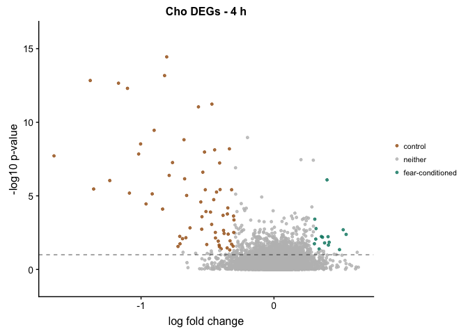
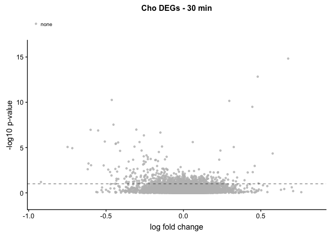
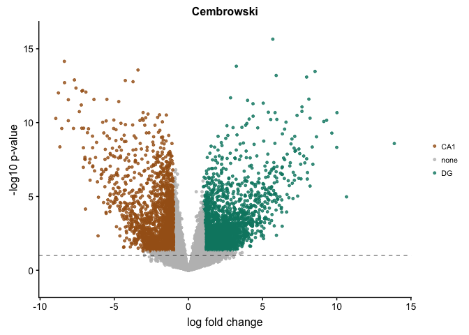

    library(readxl)
    library(ggplot2)
    library(cowplot)
    library(dplyr)
    library(ggrepel)
    library(plyr)

    # set output file for figures and general chunk settings
    knitr::opts_chunk$set(fig.path = '../figures/04_candidategenes/', echo = T, message = F, warning=F)

Comparison with other candidate gen lists
=========================================

1.  Sanes and Licthman 1999 analysis
2.  Cho et al 2015
3.  Cembrowksi

Sanes and licthman
------------------

Import file with information about differentially expressed genes (aka
`dissociation`) and the list of genes found in the reference
transcriptome (aka `geneids`).

    dissociation <- read.csv("../results/volcanoTreatment.csv", header = T, row.names = 1)
    geneids <- read.csv("../data/geneids.csv", header = T)

    # Filter out non-significant genes, sort by p-value, rename column, round to 2 decimal places. 

    DEGs <- dissociation %>%
      filter(direction != "none") %>%
      arrange((padj))

    # Compare to Molecules implicated in hippocampal LTP
    # create list of candidate genes Sanes and Lichtman 1999 

    sanesLichtman <- c("Gria1", "Gria2", 
           "Grm1", "Grm4", "Grm5", "Grm7",
           "Grin1", "Grin2a", "Grin2d", 
           "Th", "Drd1",
           "Adrb1", "Adrb2", "Adrb3",
           "Adra1a", "Adra1b", "Adra1d", 
           "Adra2a", "Adra2b", "Adra2c",
           "Oprm1", "Oprd1",
           "Chrm1", "Chrm2", "Chrm3", "Chrm4", "Chrm5",
           "Chrna1", "Chrna7", "Chrna3", 
           "Chrnb1", "Chrnb2", "Chrnb3",
           "Gabra1", "Gabra2",  "Gabra3", "Gabra5", "Gabra6",
           "Gabrb1", "Gabrb2", "Gabrb3",  
           "Gabrr1",  "Gabbr1",
           "Cnr1", "Cnr2",
           "Pnoc", "Oprl1",
           "Htr1a", "Htr1b", "Htr1f",
           "Htr2a", "Htr2c", "Htr2b",
           "Htr3a", "Htr3b", "Htr5a", "Htr5b",
           "Htr7", "Htr6", "Htr4", 
           "Edn1", "Egf", "Fgf2",
           "Nrg1", "Nrg2", "Nrg3",
           "Erbb4", "Ngf", "Bdnf", "Ntrk2",
           "Nos1", "Nos3",
           "Il1b",
           "Inhba", "Calm1", "Calm2", "Calm3",
           "Nrgn", "Calb1", "Calb2", "Gap43", "S100b",
           "Cacna1c", "Cacna1d", "Cacna1s", "Cacna1f",
           "Cacna1b", "Cacna1a", "Cacna1e",
           "Cnga2", "Syp", "Napa",
           "Vamp1", "Vamp2", "Vamp3", "Vamp4", "Vamp5", "Vamp8",
           "Rab3a", "Stx1b", "Syn1", "Snap25",
           "Dlg4", "Rarb", "Creb1",
           "Egr1", "Egr2", "Epha5", "Efna5", "Ncam1", "Ncam2",
           "Cdh1", "Cdh2", "Thy1", "Icam5",
           "L1cam", "Ptn", 
           "Itga1", "Itga10","Itga11", "Itga2",  "Itga2b",
           "Itga3",  "Itga4", "Itga5",  "Itga6",  "Itga7",  
           "Itga8",  "Itga9",  "Itgad",  "Itgae", "Itgal",  
           "Itgam",  "Itgav",  "Itgax",  "Itgb1",  "Itgb1bp1",
           "Itgb2",  "Itgb2l", "Itgb3",  "Itgb3bp",  "Itgb4",
           "Itgb5",  "Itgb6", "Itgb7",  "Itgb8",  "Itgbl1",
           "Cd47", "Tnc",
           "Itpka", "Itpkb", "Itpkc", 
           "Mapk1", "Mapk10", "Mapk11", "Mapk12", "Mapk14", 
           "Mapk3", "Mapk4", "Mapk6", "Mapk7", "Mapk8", "Mapk9",
           "Src", "Fyn", 
           "Prkacb", "Prkar1b",
           "Prkcg", "Prkg1", "Prkcz", 
           "Camk1",  "Camk2",  "Camk4",
           "Capn1", "Capn10", "Capn11", "Capn12", "Capn13",
           "Capn15", "Capn2", "Capn3", "Capn5", "Capn6", 
           "Capn7", "Capn8", "Capn9",
           "Cast", "Serpine2", "Plat", "Plg", "Ube3a",
           "Pla2g10", "Pla2g12a", "Pla2g12b", "Pla2g15",
           "Pla2g16", "Pla2g1b", "Pla2g2a", "Pla2g2c", "Pla2g2d",
           "Pla2g2e", "Pla2g2f", "Pla2g3",  "Pla2g4a", "Pla2g4b",
           "Pla2g4e", "Pla2g4f", "Pla2g5", "Pla2g6", "Pla2g7",
           "Plcb1", "Plcb2", "Plcb3", "Plcb4",
           "Plcg1", "Plcg2",
           "Parp1", "Ppp3ca", "Ppp3cb", "Ppp3cc",
           "Phpt1", "Ache",
           "Adcy1", "Adcy10", "Adcy2", "Adcy3", "Adcy4",
           "Adcy5", "Adcy6", "Adcy7", "Adcy8", "Adcy9",
           "Gucy1a2", "Gucy1a3", "Gucy1b2", "Gucy1b3",
           "Gucy2c", "Gucy2d", "Gucy2e", "Gucy2g",
           "Sptan1", "Sptbn1", "Gfap", "Stmn4",
           "Ccr7", "Mas1",
           "Homer1", "Homer2", "Homer3" )

    #sanesLichtman[order(sanesLichtman)] # print list alphabetically

    # confirm that all all Sanes and Lichtman genes are in the reference transcriptome
    sanesLichtman_reference <- geneids %>%
      dplyr::filter(gene %in% sanesLichtman) %>%
      dplyr::select(gene) %>%
      distinct() %>%
      arrange(gene) %>%
      droplevels()
    sanesLichtman_reference <- sanesLichtman_reference[,c(1)]
    str(sanesLichtman_reference)

    ##  Factor w/ 248 levels "Ache","Adcy1",..: 1 2 3 4 5 6 7 8 9 10 ...

    # identify which of the Sanes and Lichtman genes are present in my samples
    sanesLichtman_present <- dissociation %>%
      dplyr::filter(gene %in% sanesLichtman) %>%
      droplevels()
    sanesLichtman_present <- sanesLichtman_present[,c(1)]
    str(sanesLichtman_present)

    ##  Factor w/ 184 levels "Ache","Adcy1",..: 1 2 3 4 5 6 7 8 9 10 ...

    # identify whichof the Sanes and Lichtman genes are differentially expressed in this analysis
    sanesLichtman_DEGs <- DEGs %>%
      dplyr::filter(gene %in% sanesLichtman) %>%
        dplyr::filter(direction != "neither") %>%
      arrange(gene)
    sanesLichtman_DEGs

    ##       gene   pvalue       lfc        padj direction
    ## 1    Adcy9 1.323975 -1.420367 0.047426950      HOMO
    ## 2  Cacna1e 1.094199 -1.277796 0.080501037      HOMO
    ## 3   Gabrb1 1.987167 -1.074515 0.010299888      HOMO
    ## 4   Grin2a 1.570140 -1.659562 0.026906675      HOMO
    ## 5     Il1b 1.523350  2.405914 0.029967447      DISS
    ## 6    Itga5 1.795090  3.054466 0.016029141      DISS
    ## 7    Itgam 1.304370  1.746838 0.049616993      DISS
    ## 8    Itgb4 1.200986  2.929515 0.062952645      DISS
    ## 9    Itgb5 1.695894  1.978733 0.020142152      DISS
    ## 10   Itpkb 1.033912  1.529801 0.092488460      DISS
    ## 11   Mapk3 2.008779  1.606075 0.009799875      DISS

    # Adcy9   Adenylate Cyclase 9
    # Cacna1e Calcium Voltage-Gated Channel Subunit Alpha1 S
    # Gabrb1  Gamma-Aminobutyric Acid Type A Receptor Beta1 Subunit
    # Grin2a  NMDAR 2A
    # Il1b    Interleukin 1 Beta
    # Itga5   Integrin Subunit Alpha 5
    # Itgam   Integrin Subunit Alpha M
    # Itgb4   Integrin Subunit Beta 4
    # Itgb5   Integrin Subunit Beta 5
    # Itpkb   Inositol 1,4,5-Trisphosphate 3-Kinase B 
    # Mapk3   MAP Kinase 3

    # percent DEGs in the sanes lichtman list
    round(11/249*100,2)

    ## [1] 4.42

    round(11/184*100,2)

    ## [1] 5.98

Cho et al 2015 anlaysis
-----------------------

Cho et al 2015 used RNA sequencing to quantify transcript levels in the
mouse hippocampus after contextual fear conditioning. The Cho dataset
provides a snapshot of gene expression changes associated with
hippocampal learning and memory 30 min and 4 h after an experiment. The
Cho data are available at
<http://science.sciencemag.org/content/suppl/2015/09/30/350.6256.82.DC1>
and <https://www.ncbi.nlm.nih.gov/geo/query/acc.cgi?acc=GSE72064>. The
file `../data/aac7368-Cho.SM.Table.S2.xls` of differentially expressed
genes was used as a representative dataset for learning and memory
associated gene expression patterns.

In this analysis, I compared the Cho et al differentially expressed
genes (DEGs) to my experimental results (referred to as the Harris data)
to identify the interaction between genes that are differentially
expressed following fear condition and following a chemical
manipulation.

This analysis prints the list of genes that are differentially expressed
in both experiments. The images show that only a few (red dots) of genes
that respond to chemical dissociation are up-regulated or down-regulated
following fear-conditioning.

In the Cho et al. data, there are 9 differentially expressed genes after
4 hours with LFC &gt; 1. But there are 35 with lfc &gt; 0.25. I will go
with those since that is about the cuttoff used in the Cho paper.

    S2 <- as.data.frame(readxl::read_excel("../data/aac7368-Cho.SM.Table.S2.xls", skip = 1 ))

    fourhoursRNA <- rename(S2, c(`RNA fold change (4 h/control), log2` ="lfc", 
                       `p-value (4 h)` = "pvalue",
                       `Gene Symbol` = "gene"))
    fourhoursRNA <- wrangleCho(fourhoursRNA)

    volcanoplot1 <- plotvolcano(fourhoursRNA, fourhoursRNA$lfc, fourhoursRNA$log10p, 
                                plottitle = "Cho DEGs - 4 h") +
                    scale_color_manual(values = c("none" = "grey",
                                    "fear-conditioned" = "#018571",
                                    "control" = "#a6611a"))
    volcanoplot1

    Chofourhoursgenes <- fourhoursRNA %>%
      filter(direction != "none") %>%
      arrange(gene)
    #Chofourhoursgenes

    Cho4hrCandidates <- Chofourhoursgenes$gene
    Cho4hrCandidates

    ##  [1] "1500015O10Rik" "Abca4"         "Ace"           "Aqp1"         
    ##  [5] "Atp2a3"        "Calml4"        "Capsl"         "Ccdc135"      
    ##  [9] "Cldn2"         "Clic6"         "Col8a2"        "Efcab10"      
    ## [13] "Enpp2"         "Epn3"          "F5"            "F8"           
    ## [17] "Folr1"         "Fos"           "Gpr133"        "Itpripl1"     
    ## [21] "Kcne2"         "Kcnj13"        "Kcnj2"         "Kl"           
    ## [25] "Lama5"         "Lbp"           "Mdfic"         "Mia"          
    ## [29] "Mid1"          "Mrc1"          "Msx1"          "Mtcp1"        
    ## [33] "Npas4"         "Otx2"          "Pcdhb2"        "Pon3"         
    ## [37] "Prlr"          "Rsph1"         "Sema3b"        "Serhl"        
    ## [41] "Sgms2"         "Slc24a5"       "Slc2a12"       "Slc4a2"       
    ## [45] "Slc4a5"        "Sostdc1"       "Sowahc"        "Sulf1"        
    ## [49] "Tinagl1"       "Tmem72"        "Ttr"           "Vat1l"        
    ## [53] "Wfikkn2"       "Xrcc6"

    Cho4hrCandidatesGrepl <- c("Fos|Col8a|Wfikkn2|Lama|Tmem|Pon|Sostdc|Prlr|Sema|Otx|Pcdhb|Epn|Ccdc|Aqp|Cldn|Calml|Rsph|Clic|Kcne|Slc4|Gpr|Serhl|Efcab|F5|Kcnj|Sgms|Folr|Slc24a|Ttr|Enpp|Kl|1500015O10Rik|Kcnj|Abca|Mdfic|Msx|Itpripl")

    # see if cho 4 hour DEGs are in my DEG list
    Cho_DEGs <- DEGs %>%
      dplyr::filter(gene %in% Cho4hrCandidates) %>%
      arrange(pvalue)
    Cho_DEGs

    ##        gene     pvalue        lfc       padj direction
    ## 1     Sgms2 0.01276802  0.2543881 0.97102851   neither
    ## 2     Npas4 0.02680878 -0.4428960 0.94013715   neither
    ## 3     Serhl 0.03673165  0.7631651 0.91890022   neither
    ## 4      Prlr 0.05804705 -1.1325098 0.87488898   neither
    ## 5     Xrcc6 0.06127940 -0.6378699 0.86840156   neither
    ## 6     Vat1l 0.06267699  1.1761891 0.86561148   neither
    ## 7     Kcnj2 0.06284641 -0.6584678 0.86527388   neither
    ## 8      Mid1 0.07807780  0.4752974 0.83545334   neither
    ## 9    Pcdhb2 0.09878915 -1.1020269 0.79654597   neither
    ## 10    Lama5 0.11574654  1.1124065 0.76604355   neither
    ## 11   Tmem72 0.15332002 -0.5944371 0.70255443   neither
    ## 12   Sowahc 0.15687201  0.9552520 0.69683184   neither
    ## 13   Atp2a3 0.17076764  2.0071750 0.67488902   neither
    ## 14    Rsph1 0.19075826 -2.0581237 0.64452793   neither
    ## 15 Itpripl1 0.20601817  2.1692998 0.62227425   neither
    ## 16  Tinagl1 0.21968862  2.1186508 0.60299176   neither
    ## 17  Slc24a5 0.23049385 -1.5079843 0.58817445   neither
    ## 18       F8 0.49868657  3.0871808 0.31718558   neither
    ## 19      Ace 0.55873428  2.6949041 0.27622674   neither
    ## 20       Kl 0.58624301 -1.4434989 0.25927282   neither
    ## 21      Fos 0.91604204  0.9127611 0.12132714   neither
    ## 22   Slc4a2 0.99197314  1.8278854 0.10186544   neither
    ## 23    Enpp2 1.31048892  1.7689664 0.04892278      DISS

    # see if related cho 4 hour DEGs are in my DEG list
    Cho_DEGs <- DEGs %>%
      dplyr::filter(grepl(Cho4hrCandidatesGrepl, gene)) %>%
      arrange(pvalue)
    Cho_DEGs

    ##         gene       pvalue         lfc         padj direction
    ## 1     Tmem11 0.0001052585  0.00787807 0.9997576628   neither
    ## 2    Tmem41a 0.0005858998 -0.02431898 0.9986518255   neither
    ## 3      Sgms1 0.0007295187 -0.01617664 0.9983216313   neither
    ## 4    Tmem251 0.0007295187  0.03769002 0.9983216313   neither
    ## 5    Efcab14 0.0011579915 -0.01587544 0.9973371776   neither
    ## 6      Klf11 0.0011579915  0.03656262 0.9973371776   neither
    ## 7   Tmem183a 0.0011579915  0.01727962 0.9973371776   neither
    ## 8    Ccdc174 0.0016286693  0.03331531 0.9962568734   neither
    ## 9   Tmem191c 0.0019213191  0.01718958 0.9955857708   neither
    ## 10    Cldnd1 0.0021824682  0.03187897 0.9949872871   neither
    ## 11    Pcdhb3 0.0021824682 -0.05650124 0.9949872871   neither
    ## 12  Tmem255a 0.0021824682  0.02630345 0.9949872871   neither
    ## 13    Klhl26 0.0022344182 -0.02383330 0.9948682745   neither
    ## 14   Tmem117 0.0022344182  0.06674060 0.9948682745   neither
    ## 15  Tmem170b 0.0023298753  0.02457498 0.9946496284   neither
    ## 16    Tmem29 0.0023596483 -0.05470532 0.9945814426   neither
    ## 17   Tmem144 0.0027342562 -0.05097367 0.9937239197   neither
    ## 18    Ccdc66 0.0027554021 -0.05774308 0.9936755363   neither
    ## 19    Ccdc82 0.0027554021  0.07842621 0.9936755363   neither
    ## 20   Tmem127 0.0027554021 -0.02627132 0.9936755363   neither
    ## 21  Tmem132d 0.0027554021 -0.04258753 0.9936755363   neither
    ## 22   Tmem214 0.0027554021  0.02702425 0.9936755363   neither
    ## 23   Tmem41b 0.0027567039 -0.03897776 0.9936725579   neither
    ## 24    Gpr162 0.0029846301 -0.02144066 0.9931511958   neither
    ## 25  Tmem151a 0.0031738975 -0.02589893 0.9927184706   neither
    ## 26  Tmem161b 0.0031738975  0.06121883 0.9927184706   neither
    ## 27   Ccdc151 0.0032032866  0.12344417 0.9926512949   neither
    ## 28    Ccdc61 0.0035324737  0.07100338 0.9918991688   neither
    ## 29   Tmem55a 0.0035324737 -0.04086124 0.9918991688   neither
    ## 30   Slc41a1 0.0037385089  0.03946992 0.9914287100   neither
    ## 31    Ccdc97 0.0037477101 -0.03801015 0.9914077052   neither
    ## 32    Tmem47 0.0042752066  0.05812590 0.9902042669   neither
    ## 33   Tmem246 0.0042915446  0.04127238 0.9901670165   neither
    ## 34     Abca1 0.0050300934  0.05964365 0.9884845976   neither
    ## 35     Klhl5 0.0050300934 -0.05068906 0.9884845976   neither
    ## 36    Tmem57 0.0050568669  0.04594918 0.9884236612   neither
    ## 37    Pcdhb8 0.0052134369 -0.13716915 0.9880673830   neither
    ## 38  Tmem167b 0.0052868843 -0.05124490 0.9879002962   neither
    ## 39   Pcdhb17 0.0053518244 -0.08511655 0.9877525865   neither
    ## 40   Tmem39b 0.0054614118  0.14251836 0.9875033740   neither
    ## 41  Slc4a1ap 0.0057882732  0.08741336 0.9867604329   neither
    ## 42   Ccdc190 0.0059631044  0.15328251 0.9863632788   neither
    ## 43    Ccdc64 0.0060233259  0.06985865 0.9862265142   neither
    ## 44   Tmem231 0.0068599832 -0.10782745 0.9843284026   neither
    ## 45    Tmem28 0.0068711923  0.06253396 0.9843029975   neither
    ## 46    Sema4b 0.0069693595  0.08558001 0.9840805326   neither
    ## 47   Ccdc137 0.0076687875  0.09302881 0.9824969538   neither
    ## 48   Tmem201 0.0078134211  0.04072334 0.9821698061   neither
    ## 49   Tmem260 0.0078134211  0.08324167 0.9821698061   neither
    ## 50   Ccdc116 0.0078300795  0.19707690 0.9821321333   neither
    ## 51  Tmem132a 0.0078300795  0.05281092 0.9821321333   neither
    ## 52   Tmem234 0.0092816908 -0.07911605 0.9788548775   neither
    ## 53    Ccdc86 0.0098272816 -0.14258138 0.9776259444   neither
    ## 54   Ccdc155 0.0098425173  0.29170148 0.9775916483   neither
    ## 55      Klf7 0.0099221729 -0.09430010 0.9774123611   neither
    ## 56     Gpr62 0.0100632276  0.18494131 0.9770949582   neither
    ## 57  Tmem185a 0.0106681241  0.10442234 0.9757349826   neither
    ## 58    Klhdc2 0.0115486796 -0.07733578 0.9737586316   neither
    ## 59    Klhl32 0.0118652412 -0.17606484 0.9730491078   neither
    ## 60  Tmem229a 0.0118652412 -0.09913868 0.9730491078   neither
    ## 61    Tmem64 0.0118652412 -0.13347169 0.9730491078   neither
    ## 62   Ccdc107 0.0120542434  0.20228181 0.9726257352   neither
    ## 63   Ccdc166 0.0120542434  0.20310385 0.9726257352   neither
    ## 64    Ccdc60 0.0120542434  0.20376146 0.9726257352   neither
    ## 65    Klhl15 0.0120542434  0.12462148 0.9726257352   neither
    ## 66   Slc45a4 0.0120542434  0.10238583 0.9726257352   neither
    ## 67   Tmem63c 0.0120542434  0.08923127 0.9726257352   neither
    ## 68     Tmem8 0.0120542434 -0.11486820 0.9726257352   neither
    ## 69   Ccdc148 0.0121100517 -0.13275907 0.9725007575   neither
    ## 70  Tmem120a 0.0126853218  0.16464131 0.9712134276   neither
    ## 71     Tmem9 0.0127014085 -0.12943015 0.9711774536   neither
    ## 72    Ccdc58 0.0127680199  0.23750057 0.9710285074   neither
    ## 73      Klc4 0.0127680199 -0.16112269 0.9710285074   neither
    ## 74    Rsph3a 0.0127680199  0.16725861 0.9710285074   neither
    ## 75     Sgms2 0.0127680199  0.25438813 0.9710285074   neither
    ## 76   Tmem169 0.0127680199  0.23230764 0.9710285074   neither
    ## 77   Tmem198 0.0127680199  0.09134884 0.9710285074   neither
    ## 78    Tmem80 0.0127680199  0.15180404 0.9710285074   neither
    ## 79    Tmem9b 0.0127680199 -0.10313625 0.9710285074   neither
    ## 80    Ccdc43 0.0130752953  0.17534750 0.9703417208   neither
    ## 81    Ccdc34 0.0134477581  0.22209779 0.9695098860   neither
    ## 82   Tmem256 0.0136052689  0.18407639 0.9691583259   neither
    ## 83    Sema4a 0.0137901959  0.16680059 0.9687457364   neither
    ## 84   Tmem219 0.0138941978  0.24588353 0.9685137755   neither
    ## 85    Tmem18 0.0145851770  0.11957342 0.9669740580   neither
    ## 86    Ccdc92 0.0146916073 -0.09083977 0.9667371159   neither
    ## 87   Ccdc173 0.0147880435 -0.34280657 0.9665224733   neither
    ## 88    Sema7a 0.0147880435 -0.10046549 0.9665224733   neither
    ## 89   Tmem110 0.0147880435  0.13694227 0.9665224733   neither
    ## 90    Tmem33 0.0155147212 -0.11951202 0.9649066039   neither
    ## 91    Ccdc12 0.0157003428 -0.15813446 0.9644942818   neither
    ## 92   Tmem177 0.0157003428 -0.30627899 0.9644942818   neither
    ## 93      Aqp4 0.0157258037 -0.14517643 0.9644377391   neither
    ## 94   Gpr37l1 0.0157258037  0.11205582 0.9644377391   neither
    ## 95    Kcnj11 0.0157258037  0.13165975 0.9644377391   neither
    ## 96  Tmem198b 0.0157258037 -0.31281424 0.9644377391   neither
    ## 97   Tmem203 0.0157258037 -0.24129339 0.9644377391   neither
    ## 98   Tmem208 0.0157258037 -0.22672940 0.9644377391   neither
    ## 99      Klc2 0.0160175261 -0.07480098 0.9637901288   neither
    ## 100  Ccdc159 0.0171828603 -0.24858318 0.9612074754   neither
    ## 101  Tmem107 0.0171828603  0.34201230 0.9612074754   neither
    ## 102   Ccdc14 0.0188652175  0.46965733 0.9574911809   neither
    ## 103 Tmem151b 0.0188973784  0.12500080 0.9574202781   neither
    ## 104  Tmem205 0.0193407005  0.29070939 0.9564434547   neither
    ## 105   Ccdc47 0.0198644373 -0.12095069 0.9552907284   neither
    ## 106   Gpr176 0.0198644373 -0.27157809 0.9552907284   neither
    ## 107    Klf10 0.0208088604  0.20356261 0.9532155963   neither
    ## 108   Tmem65 0.0211435090  0.14982655 0.9524813725   neither
    ## 109   Ccdc93 0.0211467771 -0.14884624 0.9524742050   neither
    ## 110  Ccdc28a 0.0212017084  0.20154504 0.9523537398   neither
    ## 111  Tmem189 0.0223857789  0.17945043 0.9497607571   neither
    ## 112 Tmem120b 0.0229352884  0.30305082 0.9485597919   neither
    ## 113  Tmem240 0.0230901702  0.30582937 0.9482215688   neither
    ## 114  Tmem50a 0.0231435261 -0.15033623 0.9481050806   neither
    ## 115   Efcab6 0.0235984452  0.40858113 0.9471124702   neither
    ## 116  Tmem245 0.0235984452 -0.14671686 0.9471124702   neither
    ## 117  Tmem87a 0.0235984452  0.15869369 0.9471124702   neither
    ## 118  Klhdc7a 0.0237556850  0.24832653 0.9467696225   neither
    ## 119   Ccdc84 0.0242443853  0.37336867 0.9457048466   neither
    ## 120  Slc46a1 0.0243632629  0.35484687 0.9454460180   neither
    ## 121  Ccdc134 0.0247141386  0.36824053 0.9446824807   neither
    ## 122  Tmem179 0.0252502412  0.14753286 0.9435170636   neither
    ## 123  Tmem192 0.0253344811  0.35492288 0.9433340677   neither
    ## 124  Ccdc181 0.0263231164 -0.24078303 0.9411890885   neither
    ## 125   Rsph3b 0.0263231164  0.26803727 0.9411890885   neither
    ## 126   Klhl23 0.0265352539 -0.13691875 0.9407294631   neither
    ## 127  Tmem104 0.0273878064 -0.42534836 0.9388845525   neither
    ## 128  Tmem63b 0.0277984371 -0.12260527 0.9379972453   neither
    ## 129   Klhl22 0.0278561154 -0.15499493 0.9378726789   neither
    ## 130  Ccdc90b 0.0280589812  0.35102188 0.9374346859   neither
    ## 131 Tmem176a 0.0280612316  0.43325462 0.9374298285   neither
    ## 132    Klf13 0.0281887678 -0.13935928 0.9371545805   neither
    ## 133  Tmem35a 0.0284556842 -0.22918666 0.9365787845   neither
    ## 134  Ccdc141 0.0290950898  0.49447329 0.9352008872   neither
    ## 135    Ccdc9 0.0290950898  0.19725526 0.9352008872   neither
    ## 136    Fosl2 0.0290950898  0.41664404 0.9352008872   neither
    ## 137  Gprasp2 0.0290950898 -0.14361627 0.9352008872   neither
    ## 138   Sema4f 0.0290950898 -0.16802166 0.9352008872   neither
    ## 139  Tmem50b 0.0290950898  0.22603719 0.9352008872   neither
    ## 140  Tmem237 0.0299024137  0.28259145 0.9334640273   neither
    ## 141  Tmem230 0.0302556778 -0.36082704 0.9327050371   neither
    ## 142  Tmem167 0.0305884009 -0.24634107 0.9319907439   neither
    ## 143 Tmem106b 0.0308665903 -0.13520309 0.9313939437   neither
    ## 144  Slc43a2 0.0314739210 -0.16918882 0.9300923644   neither
    ## 145  Pcdhb12 0.0319442147 -0.43286185 0.9290857206   neither
    ## 146   Gpr108 0.0320033525  0.31429069 0.9289592158   neither
    ## 147    Lama2 0.0320033525  0.43926911 0.9289592158   neither
    ## 148  Tmem130 0.0320953597 -0.21896593 0.9287624324   neither
    ## 149    Lama3 0.0329228518  0.54721409 0.9269944803   neither
    ## 150   Cldn12 0.0329768346 -0.28752922 0.9268792621   neither
    ## 151    Kcnj9 0.0329768346 -0.21848468 0.9268792621   neither
    ## 152 Tmem126b 0.0329768346 -0.29415906 0.9268792621   neither
    ## 153  Tmem115 0.0331112039  0.30237699 0.9265925330   neither
    ## 154 Tmem178b 0.0334328067 -0.31300111 0.9259066288   neither
    ## 155   Sema6b 0.0337518279  0.12104410 0.9252267321   neither
    ## 156   Klhl35 0.0347579686 -0.75698751 0.9230857175   neither
    ## 157 Tmem200c 0.0347579686 -0.47438817 0.9230857175   neither
    ## 158   Ccdc39 0.0351070635 -0.43111404 0.9223440202   neither
    ## 159   Ccdc13 0.0352412330 -0.63636269 0.9220591183   neither
    ## 160  Efcab12 0.0352412330 -0.53209214 0.9220591183   neither
    ## 161   Gprin1 0.0352412330 -0.23726561 0.9220591183   neither
    ## 162  Tmem209 0.0361601340 -0.32019204 0.9201102441   neither
    ## 163 Cldn34c1 0.0361698112 -0.65914256 0.9200897419   neither
    ## 164    Serhl 0.0367316467  0.76316512 0.9189002154   neither
    ## 165    Gpr25 0.0375002022 -0.68834449 0.9172755083   neither
    ## 166  Tmem261 0.0376374545 -0.45750956 0.9169856629   neither
    ## 167  Ccdc117 0.0378635961  0.38160871 0.9165083034   neither
    ## 168  Tmem38a 0.0379003440  0.23479578 0.9164307561   neither
    ## 169    Aqp11 0.0387914104  0.35103814 0.9145523911   neither
    ## 170  Ccdc130 0.0389801790 -0.43255737 0.9141549620   neither
    ## 171  Tmem243 0.0389801790  0.46422940 0.9141549620   neither
    ## 172     Gpr3 0.0392088829 -0.61191630 0.9136736856   neither
    ## 173   Tmem62 0.0395602071 -0.30619617 0.9129348645   neither
    ## 174   Ccdc94 0.0398882655 -0.68624446 0.9122455100   neither
    ## 175  Slc46a3 0.0398882655  0.63307967 0.9122455100   neither
    ## 176  Tmem59l 0.0399237889  0.15916511 0.9121708955   neither
    ## 177   Ccdc32 0.0407828437  0.30223885 0.9103683621   neither
    ## 178  Ccdc74a 0.0412962246  0.37305804 0.9092928485   neither
    ## 179    Klf12 0.0414601899  0.54078760 0.9089496152   neither
    ## 180     Epn2 0.0416543497  0.17958184 0.9085433424   neither
    ## 181  Tmem163 0.0416543497  0.89216715 0.9085433424   neither
    ## 182  Slc44a5 0.0420735889  0.31607310 0.9076667177   neither
    ## 183  Tmem14c 0.0421924658  0.33594339 0.9074183015   neither
    ## 184  Pcdhb22 0.0432538093 -0.42892936 0.9052034296   neither
    ## 185  Tmem165 0.0437982315 -0.38447308 0.9040693971   neither
    ## 186   Ccdc77 0.0447040200 -0.83743560 0.9021857849   neither
    ## 187     Klc1 0.0454418260  0.15629725 0.9006543979   neither
    ## 188  Tmem86a 0.0464889958  0.60634469 0.8984853582   neither
    ## 189  Ccdc71l 0.0470316197 -0.37231891 0.8973634577   neither
    ## 190    Gpr19 0.0478244244 -0.55867708 0.8957268148   neither
    ## 191    Gpr85 0.0511719169 -0.30955435 0.8888491944   neither
    ## 192 Tmem126a 0.0529331852  0.56929435 0.8852517925   neither
    ## 193   Ccdc91 0.0530723057  0.37687689 0.8849682592   neither
    ## 194  Slc40a1 0.0530723057  1.02029783 0.8849682592   neither
    ## 195   Gpr157 0.0535995276 -0.83601427 0.8838945833   neither
    ## 196   Efcab1 0.0541639453 -0.81761918 0.8827466025   neither
    ## 197   Klhl17 0.0553376971  0.23186881 0.8803640567   neither
    ## 198    Gpr83 0.0554771144  0.57701254 0.8800814873   neither
    ## 199  Slc41a3 0.0572595154  1.13078474 0.8764769203   neither
    ## 200    Klhl2 0.0580470517  0.20349014 0.8748889842   neither
    ## 201     Klk8 0.0580470517  0.56743940 0.8748889842   neither
    ## 202   Pcdhb5 0.0580470517 -0.72151376 0.8748889842   neither
    ## 203     Prlr 0.0580470517 -1.13250979 0.8748889842   neither
    ## 204  Slc45a1 0.0580470517  0.35711892 0.8748889842   neither
    ## 205   Slc4a4 0.0580470517 -0.32362021 0.8748889842   neither
    ## 206  Tmem164 0.0580470517 -0.64404560 0.8748889842   neither
    ## 207 Tmem229b 0.0580470517  0.41444204 0.8748889842   neither
    ## 208   Tmem98 0.0580470517  0.77572747 0.8748889842   neither
    ## 209  Ccdc112 0.0581877479 -0.55853816 0.8746055968   neither
    ## 210   Klhl13 0.0584964255 -0.39430697 0.8739841860   neither
    ## 211   Ccdc30 0.0588878470 -0.65292745 0.8731968352   neither
    ## 212   Klhl18 0.0588878470 -0.42008307 0.8731968352   neither
    ## 213   Ccdc57 0.0591188086 -0.73111421 0.8727325850   neither
    ## 214   Gpr158 0.0598703374 -0.25649941 0.8712236629   neither
    ## 215    Kcnj2 0.0628464068 -0.65846782 0.8652738786   neither
    ## 216  Tmem145 0.0628517566 -0.52773724 0.8652632200   neither
    ## 217   Tmem69 0.0628517566 -0.71672300 0.8652632200   neither
    ## 218    Gpr61 0.0640814124 -0.76557836 0.8628167898   neither
    ## 219     Klf5 0.0653776535 -1.14560421 0.8602453753   neither
    ## 220  Tmem186 0.0668333115 -0.54469578 0.8573668519   neither
    ## 221  Tmem248 0.0668333115  0.29661477 0.8573668519   neither
    ## 222    Klkb1 0.0670084767  0.84132621 0.8570211175   neither
    ## 223    Tmem5 0.0670826444 -0.63307691 0.8568747701   neither
    ## 224    Enpp5 0.0671962648 -0.22418776 0.8566506232   neither
    ## 225  Ccdc85a 0.0678873931 -0.32203736 0.8552884493   neither
    ## 226  Pcdhb16 0.0678873931 -0.87007268 0.8552884493   neither
    ## 227  Tmem109 0.0678873931 -0.43168364 0.8552884493   neither
    ## 228  Slc24a4 0.0689733611 -0.66389037 0.8531524433   neither
    ## 229   Klhl40 0.0694268016 -1.17572283 0.8522621443   neither
    ## 230    Enpp4 0.0710109640  0.43236261 0.8491590373   neither
    ## 231    Klhl7 0.0710650618 -0.28278255 0.8490532687   neither
    ## 232  Tmem215 0.0715297255  3.27817697 0.8481453288   neither
    ## 233    Abca3 0.0733086705 -0.24314443 0.8446782851   neither
    ## 234    Klf16 0.0733502665 -0.31313273 0.8445973870   neither
    ## 235     Pon2 0.0743727268  0.55060810 0.8426112887   neither
    ## 236    Gpr26 0.0746830504 -0.41012062 0.8420094189   neither
    ## 237  Pcdhb11 0.0750408294 -0.78250932 0.8413160432   neither
    ## 238   Slc4a7 0.0773867053 -0.41621154 0.8367838597   neither
    ## 239    Gpr63 0.0780778019 -0.78594937 0.8354533371   neither
    ## 240   Gpr180 0.0794550037 -0.69425119 0.8328082070   neither
    ## 241  Ccdc171 0.0796597972  1.25050021 0.8324155851   neither
    ## 242    Klhl9 0.0799185283 -0.40683280 0.8319198208   neither
    ## 243  Tmem160 0.0799185283  0.61894623 0.8319198208   neither
    ## 244    Rsph9 0.0800075617  0.79858097 0.8317492890   neither
    ## 245  Tmem199 0.0824357137  0.52398174 0.8271119325   neither
    ## 246  Pcdhb18 0.0839769238 -0.96757689 0.8241819067   neither
    ## 247    Gpr45 0.0845926934 -0.92157758 0.8230141587   neither
    ## 248  Tmem138 0.0845926934 -0.98311367 0.8230141587   neither
    ## 249  Ccdc88b 0.0876380600  0.89561259 0.8172631928   neither
    ## 250 Tmem106c 0.0876380600 -0.61787876 0.8172631928   neither
    ## 251  Ccdc28b 0.0877597713 -1.05047233 0.8170341864   neither
    ## 252   Gpr161 0.0907485756 -1.39388198 0.8114306803   neither
    ## 253   Kcnj10 0.0919424170  0.34318430 0.8092031842   neither
    ## 254  Ccdc114 0.0921384723 -1.12093485 0.8088379648   neither
    ## 255    Gpr27 0.0936848211  0.47544932 0.8059631376   neither
    ## 256   Ccdc73 0.0940350267 -0.83752206 0.8053134884   neither
    ## 257 Tmem185b 0.0940980496 -0.82044970 0.8051966335   neither
    ## 258 Itpripl2 0.0948824764  1.09917326 0.8037435922   neither
    ## 259  Tmem242 0.0973982727  0.57941424 0.7991010978   neither
    ## 260  Ccdc115 0.0981546330 -0.81755414 0.7977106074   neither
    ## 261   Pcdhb2 0.0987891548 -1.10202690 0.7965459709   neither
    ## 262  Tmem86b 0.0987891548 -1.05686116 0.7965459709   neither
    ## 263   Klhl21 0.1000879195  0.66119546 0.7941674455   neither
    ## 264   Klhdc4 0.1010304564 -0.60286954 0.7924457555   neither
    ## 265   Tmem94 0.1010304564 -0.40539802 0.7924457555   neither
    ## 266  Tmem258 0.1011334641  0.65130991 0.7922578224   neither
    ## 267  Ccdc184 0.1022748621 -0.78926808 0.7901783711   neither
    ## 268   Klhl20 0.1026169826 -0.88893293 0.7895561441   neither
    ## 269   Sema6c 0.1029306546 -0.45280955 0.7889860879   neither
    ## 270   Tmem60 0.1034439172 -0.94303489 0.7880541905   neither
    ## 271  Tmem38b 0.1036144314  0.70301571 0.7877448428   neither
    ## 272  Slc44a2 0.1037852850  0.47948222 0.7874350009   neither
    ## 273 Tmem184b 0.1042717716  0.35501168 0.7865534285   neither
    ## 274  Tmem136 0.1055293286 -0.91426893 0.7842791535   neither
    ## 275  Tmem131 0.1068348141 -0.41611323 0.7819251569   neither
    ## 276   Tmem97 0.1074033114  0.95855192 0.7809022760   neither
    ## 277  Ccdc127 0.1081455365 -0.44561497 0.7795688253   neither
    ## 278  Slc4a10 0.1094814158 -0.36492511 0.7771745747   neither
    ## 279   Ccdc59 0.1122911260 -0.81744151 0.7721627982   neither
    ## 280  Ccdc191 0.1139311585 -1.28126710 0.7692523674   neither
    ## 281    Lama5 0.1157465403  1.11240650 0.7660435491   neither
    ## 282  Tmem216 0.1165361076  1.32546351 0.7646521120   neither
    ## 283 Tmem184c 0.1165511436 -0.47286441 0.7646256389   neither
    ## 284   Klhl12 0.1171691921  0.51952049 0.7635382669   neither
    ## 285 Tmem132e 0.1171691921  0.86804229 0.7635382669   neither
    ## 286   Ccdc25 0.1181128989 -0.75268602 0.7618809263   neither
    ## 287   Abca8b 0.1183749754  0.52579270 0.7614213052   neither
    ## 288  Ccdc149 0.1183749754 -0.41353830 0.7614213052   neither
    ## 289    Tmem2 0.1183749754 -1.00118973 0.7614213052   neither
    ## 290    Fosl1 0.1189236914  0.90282023 0.7604598834   neither
    ## 291   Gpr135 0.1210404210 -0.83757527 0.7567624578   neither
    ## 292  Slc41a2 0.1217247182  0.67904556 0.7555710020   neither
    ## 293    Abca6 0.1232408965 -1.59759459 0.7529378047   neither
    ## 294     Aqp9 0.1239018787  1.62786388 0.7517927293   neither
    ## 295  Tmem121 0.1239018787  0.78893512 0.7517927293   neither
    ## 296    Gpr75 0.1239922101  1.16562429 0.7516363759   neither
    ## 297  Tmem267 0.1265272787 -0.92502364 0.7472616961   neither
    ## 298  Tmem222 0.1282367160  0.39510832 0.7443261619   neither
    ## 299  Tmem100 0.1292024668  1.16522790 0.7426728252   neither
    ## 300   Cldn19 0.1321190269 -1.69558582 0.7377020208   neither
    ## 301  Ccdc85c 0.1336923556  0.71404359 0.7350343654   neither
    ## 302    Abca5 0.1342827543 -0.65047613 0.7340358069   neither
    ## 303  Ccdc120 0.1346984873  0.84337094 0.7333334796   neither
    ## 304   Tmem25 0.1350645057  0.47848966 0.7327156949   neither
    ## 305 Tmem176b 0.1351280780  1.14878064 0.7326084474   neither
    ## 306     Klf3 0.1371101101 -0.52349307 0.7292725886   neither
    ## 307  Ccdc186 0.1375111268 -0.58125160 0.7285995072   neither
    ## 308  Pcdhb19 0.1376530936 -0.89096750 0.7283613738   neither
    ## 309   Tmem8b 0.1376530936 -0.42415972 0.7283613738   neither
    ## 310   Ccdc53 0.1416479737  0.92987960 0.7216922245   neither
    ## 311  Ccdc92b 0.1416479737 -0.57041517 0.7216922245   neither
    ## 312   Gpr155 0.1416479737  0.46497336 0.7216922245   neither
    ## 313  Tmem114 0.1442813556  2.24874471 0.7173294223   neither
    ## 314  Tmem39a 0.1460410175  1.03212514 0.7144288478   neither
    ## 315  Gpr137b 0.1466513900  0.58631644 0.7134254699   neither
    ## 316   Klhl31 0.1493228490  1.49786050 0.7090504730   neither
    ## 317  Tmem101 0.1503995013 -1.05481055 0.7072948546   neither
    ## 318  Ccdc189 0.1512094852 -1.51748737 0.7059769388   neither
    ## 319  Tmem266 0.1531800103  1.29336251 0.7027809645   neither
    ## 320   Tmem72 0.1533200245 -0.59443713 0.7025544282   neither
    ## 321    Kcnj4 0.1555469053 -0.83261735 0.6989612425   neither
    ## 322    Gpr89 0.1564948148 -0.75007377 0.6974373238   neither
    ## 323   Pcdhb9 0.1564948148  0.60306499 0.6974373238   neither
    ## 324  Tmem178 0.1564948148  0.70921123 0.6974373238   neither
    ## 325  Tmem108 0.1597028657  1.41704391 0.6923044677   neither
    ## 326  Tmem158 0.1602568484 -0.66273710 0.6914219324   neither
    ## 327  Pcdhb21 0.1604806499 -1.66262159 0.6910657193   neither
    ## 328   Slc4a3 0.1611620940  0.36804357 0.6899822300   neither
    ## 329   Tmem74 0.1625641222 -1.15409874 0.6877583594   neither
    ## 330  Klhdc8b 0.1685092627  1.07603833 0.6784076511   neither
    ## 331    Gpr12 0.1690398360 -0.85116078 0.6775793532   neither
    ## 332   Tmem56 0.1690398360 -0.65085008 0.6775793532   neither
    ## 333  Tmem129 0.1721038786 -0.93646771 0.6728157067   neither
    ## 334  Tmem175 0.1721038786  0.58128031 0.6728157067   neither
    ## 335  Tmem204 0.1743300392  1.58433941 0.6693757285   neither
    ## 336   Klhdc3 0.1754293466  0.36545907 0.6676835145   neither
    ## 337     Klf8 0.1772056122  2.07564261 0.6649582641   neither
    ## 338  Tmem147 0.1775548915  0.96381862 0.6644236896   neither
    ## 339  Slc24a3 0.1796813508 -0.49031534 0.6611783878   neither
    ## 340   Pcdhb7 0.1815094225 -1.15657928 0.6584011450   neither
    ## 341  Ccdc167 0.1817846241 -1.17231575 0.6579840649   neither
    ## 342  Tmem125 0.1818338603  1.51402398 0.6579094730   neither
    ## 343    Abca7 0.1830665721  0.94546258 0.6560446949   neither
    ## 344 Ccdc109b 0.1830991764  2.23725736 0.6559954447   neither
    ## 345 Tmem161a 0.1838596261  0.99449249 0.6548478017   neither
    ## 346  Tmem206 0.1843789129  1.39611069 0.6540652667   neither
    ## 347   Kcnj16 0.1855565505  1.26460554 0.6522940987   neither
    ## 348   Sema3e 0.1871556388 -0.82880288 0.6498967441   neither
    ## 349  Pcdhb20 0.1873745263 -1.55864521 0.6495692741   neither
    ## 350 Tmem200a 0.1889177703 -1.20420912 0.6472651580   neither
    ## 351   Gpr146 0.1893904450  1.03885306 0.6465610748   neither
    ## 352  Ccdc136 0.1894787534  0.61697770 0.6464296179   neither
    ## 353    Rsph1 0.1907582580 -2.05812368 0.6445279303   neither
    ## 354  Tmem168 0.1908008977  0.90594378 0.6444646526   neither
    ## 355   Tmem19 0.1910610598  0.70073826 0.6440787046   neither
    ## 356   Tmem43 0.1938589607  0.67008549 0.6399426262   neither
    ## 357   Tmem59 0.1941325693  0.46099955 0.6395395849   neither
    ## 358   Gpr153 0.1972427413  1.10804790 0.6349759239   neither
    ## 359  Tmem128 0.1993059694 -0.98398267 0.6319664611   neither
    ## 360  Gpr137c 0.2046324418 -1.09222662 0.6242629470   neither
    ## 361   Sema6d 0.2046324418  0.92703900 0.6242629470   neither
    ## 362  Tmem259 0.2046324418  0.53225162 0.6242629470   neither
    ## 363   Ccdc50 0.2048387483  0.61536160 0.6239664685   neither
    ## 364    Klf15 0.2048387483 -1.31528878 0.6239664685   neither
    ## 365 Itpripl1 0.2060181678  2.16929983 0.6222742531   neither
    ## 366    Klhl8 0.2061261485 -1.08197477 0.6221195532   neither
    ## 367  Tmem218 0.2061261485  1.39575581 0.6221195532   neither
    ## 368   Klhl34 0.2062727081 -0.76319844 0.6219096446   neither
    ## 369   Klhdc1 0.2085479037 -1.13816588 0.6186600841   neither
    ## 370   Klhl42 0.2122053725 -0.99522143 0.6134718333   neither
    ## 371  Tmem263 0.2127921570 -0.82922583 0.6126435181   neither
    ## 372   Tmem68 0.2136378556 -0.85074060 0.6114516826   neither
    ## 373  Tmem268 0.2141739335 -1.70320145 0.6106973936   neither
    ## 374   Tmem70 0.2152614477  0.68289706 0.6091700631   neither
    ## 375    Gpr68 0.2153788732  1.84417153 0.6090053766   neither
    ## 376   Cldn10 0.2158879806  0.85225463 0.6082918803   neither
    ## 377  Tmem14a 0.2226949176 -1.14206164 0.5988321139   neither
    ## 378    Abca9 0.2293459820  1.13063860 0.5897310819   neither
    ## 379   Gpr173 0.2303391033 -1.88953893 0.5883840573   neither
    ## 380  Tmem87b 0.2303391033 -0.74784964 0.5883840573   neither
    ## 381  Slc24a5 0.2304938480 -1.50798426 0.5881744458   neither
    ## 382   Ccdc22 0.2337779843 -0.79986502 0.5837434435   neither
    ## 383  Pcdhb13 0.2416702330 -1.67015848 0.5732311297   neither
    ## 384   Ccdc71 0.2418414593  1.02597001 0.5730051703   neither
    ## 385   Sema4c 0.2418414593  0.87736022 0.5730051703   neither
    ## 386  Klhdc10 0.2452569967 -0.52479833 0.5685164078   neither
    ## 387    Ccdc8 0.2455029562 -2.22614946 0.5681945239   neither
    ## 388     Otx1 0.2470697579  2.58819009 0.5661483450   neither
    ## 389  Ccdc124 0.2501409321  0.64706063 0.5621588705   neither
    ## 390  Tmem143 0.2501409321 -1.50426721 0.5621588705   neither
    ## 391  Ccdc88a 0.2502752045 -0.76611154 0.5619850926   neither
    ## 392   Sema3a 0.2623245416 -2.08063766 0.5466073390   neither
    ## 393  Ccdc106 0.2633825748  0.77980744 0.5452773087   neither
    ## 394   Pcdhb6 0.2677629511 -2.33918958 0.5398051814   neither
    ## 395 Tmem254a 0.2677629511 -1.73990293 0.5398051814   neither
    ## 396 Tmem254b 0.2677629511 -1.73990293 0.5398051814   neither
    ## 397   Efcab2 0.2754989481  1.18146336 0.5302748771   neither
    ## 398   Efcab5 0.2754989481 -2.12991985 0.5302748771   neither
    ## 399   Sema3c 0.2780820232  1.31735413 0.5271302954   neither
    ## 400   Tmem42 0.2789221385  1.71096398 0.5261115807   neither
    ## 401   Klhl28 0.2789448389  1.33495228 0.5260840818   neither
    ## 402 Tmem254c 0.2819547952  2.44343829 0.5224505669   neither
    ## 403   Tmem44 0.2917800282  1.22969959 0.5107636382   neither
    ## 404   Tmem67 0.2928952511 -2.28477921 0.5094537330   neither
    ## 405  Tmem123 0.2944031545  1.50861546 0.5076879383   neither
    ## 406   Klhl25 0.2955614167  1.74673388 0.5063357399   neither
    ## 407   Gpr107 0.2957725771 -0.85117736 0.5060896118   neither
    ## 408    Ccdc6 0.2965876207 -0.94709624 0.5051407205   neither
    ## 409 Tmem181a 0.2989765460 -0.52511802 0.5023697191   neither
    ## 410  Gprasp1 0.3087490809 -0.43846348 0.4911915863   neither
    ## 411    Clic1 0.3098137501  2.22760068 0.4899889091   neither
    ## 412  Tmem252 0.3133667979  2.46627978 0.4859965677   neither
    ## 413     Epn1 0.3283242715  0.56179112 0.4695433872   neither
    ## 414   Ccdc65 0.3360620583  2.81446782 0.4612516596   neither
    ## 415   Sema4d 0.3430307745  0.92708977 0.4539094510   neither
    ## 416 Tmem150c 0.3504679039 -0.93016643 0.4462025995   neither
    ## 417   Klhl29 0.3513071031 -0.87367788 0.4453412225   neither
    ## 418  Pcdhb14 0.3513084107 -1.96592504 0.4453398816   neither
    ## 419 Ccdc144b 0.3589731059 -1.79198905 0.4375492000   neither
    ## 420   Sema3d 0.3651409972  2.36261219 0.4313790034   neither
    ## 421   Gpr137 0.3715804721  0.72846187 0.4250299441   neither
    ## 422  Tmem173 0.3901373822  2.85889176 0.4072514299   neither
    ## 423  Tmem135 0.3930998451  0.91880450 0.4044828897   neither
    ## 424    Klhl4 0.3939728558  1.70209118 0.4036706223   neither
    ## 425  Slc48a1 0.3948220619  0.64675156 0.4028820684   neither
    ## 426     Klf9 0.4069355089 -0.81399234 0.3918000536   neither
    ## 427   Klhl24 0.4109183084 -0.92157328 0.3882233847   neither
    ## 428    Gpr37 0.4154954763  1.24642751 0.3841532606   neither
    ## 429  Tmem55b 0.4244680729  0.84640478 0.3762980147   neither
    ## 430 Tmem150a 0.4438691083  1.35417965 0.3598577761   neither
    ## 431  Ccdc88c 0.4438848345 -1.25271898 0.3598447455   neither
    ## 432   Sema3f 0.4466195744  2.11022036 0.3575859328   neither
    ## 433 Tmem132b 0.4546932589 -0.95827296 0.3509996966   neither
    ## 434   Abca8a 0.4553096675  1.61048529 0.3505018644   neither
    ## 435     Klf6 0.4630891862  1.02305382 0.3442792227   neither
    ## 436   Gprin3 0.4657829622 -2.71379724 0.3421503888   neither
    ## 437  Ccdc85b 0.4660426444  0.74687541 0.3419458644   neither
    ## 438    Klhl3 0.4883237127 -1.25006012 0.3248450754   neither
    ## 439     Klf2 0.4996964939  1.78841822 0.3164488386   neither
    ## 440  Ccdc177 0.4997658453 -1.76906083 0.3163983097   neither
    ## 441  Tmem241 0.5158233219  1.84048333 0.3049135175   neither
    ## 442    Abca2 0.5261351956  0.84411546 0.2977589363   neither
    ## 443   Klhl11 0.5261351956 -1.17229657 0.2977589363   neither
    ## 444  Ccdc126 0.5314527881  2.01734276 0.2941353429   neither
    ## 445   Sema5b 0.5433124497  2.12822691 0.2862118101   neither
    ## 446  Ccdc157 0.5463575124  1.31839663 0.2842120503   neither
    ## 447       Kl 0.5862430085 -1.44349887 0.2592728201   neither
    ## 448    Cldn5 0.6290517397  1.88471712 0.2349352914   neither
    ## 449  Slc24a2 0.6753980177 -0.85579693 0.2111552979   neither
    ## 450  Tmem30a 0.6983688309 -0.62772967 0.2002770423   neither
    ## 451    Gpr22 0.7016293087 -1.28204929 0.1987790869   neither
    ## 452    Kcnj3 0.7981062811 -1.45084109 0.1591819127   neither
    ## 453  Slc44a1 0.8593817891  1.13184279 0.1382350618   neither
    ## 454  Tmem141 0.8851160662  2.86800229 0.1302818551   neither
    ## 455   Gprc5b 0.9059099130  1.02140667 0.1241909894   neither
    ## 456      Fos 0.9160420418  0.91276113 0.1213271394   neither
    ## 457   Sema6a 0.9402068815  1.80938061 0.1147606815   neither
    ## 458   Slc4a2 0.9919731403  1.82788543 0.1018654387   neither
    ## 459   Sema4g 1.0995179506  2.30074456 0.0795210397      DISS
    ## 460     Klf4 1.1788215470  1.74412455 0.0662488666      DISS
    ## 461   Slc4a8 1.2147293113 -1.04274102 0.0609916930      HOMO
    ## 462    Gpr17 1.2631394854  2.59999062 0.0545582604      DISS
    ## 463  Tmem63a 1.2675811630  2.45627751 0.0540031182      DISS
    ## 464    Ccdc3 1.2737961298  5.37896868 0.0532358105      DISS
    ## 465    Enpp2 1.3104889152  1.76896644 0.0489227752      DISS
    ## 466    Gpr34 1.3104889152  2.07930246 0.0489227752      DISS
    ## 467    Kcnj6 1.3599867702 -2.39206810 0.0436529130      HOMO
    ## 468     Fosb 1.4785616444  1.58513086 0.0332229625      DISS
    ## 469  Tmem170 1.5324159548  2.52657708 0.0293483740      DISS
    ## 470    Gpr84 1.7284923225  2.85825406 0.0186856271      DISS
    ## 471   Sema5a 2.5264517003  3.25156265 0.0029754201      DISS
    ## 472    Clic4 2.7426889721  2.00897237 0.0018084688      DISS
    ## 473  Tmem119 3.0220884980  2.54399835 0.0009504111      DISS
    ## 474   Cldn11 3.9794076800  3.13972898 0.0001048558      DISS
    ## 475  Tmem88b 4.1690772506  3.14119732 0.0000677521      DISS

At there Fosb is the only overlap.

    S2 <- as.data.frame(readxl::read_excel("../data/aac7368-Cho.SM.Table.S2.xls", skip = 1 ))

    thirtyminRNA <- rename(S2, c(`RNA fold change (30 min/control), log2` ="lfc", 
                       `p-value (30 min)` = "pvalue",
                       `Gene Symbol` = "gene"))
    thirtyminRNA <- wrangleCho(thirtyminRNA)

    volcanoplot3 <- plotvolcano(thirtyminRNA, thirtyminRNA$lfc, thirtyminRNA$log10p, 
                                plottitle = "Cho DEGs - 30 min")  +
                    scale_color_manual(values = c("none" = "grey",
                                    "fear-conditioned" = "#018571",
                                    "control" = "#a6611a"))
    volcanoplot3

    Cho30mingenes <- thirtyminRNA %>%
      filter(direction != "none") %>%
      arrange(gene)
    #Cho30mingenes

    Cho30minCandidates <- Cho30mingenes$gene
    Cho30minCandidates

    ##  [1] "1500015O10Rik" "Aass"          "Ackr3"         "Acta2"        
    ##  [5] "Aqp1"          "Arc"           "Arl4d"         "Btg2"         
    ##  [9] "Calml4"        "Capsl"         "Cldn2"         "Clic6"        
    ## [13] "Col8a2"        "Col9a3"        "Cyr61"         "Epn3"         
    ## [17] "F5"            "Folr1"         "Fos"           "Fosb"         
    ## [21] "Hspg2"         "Junb"          "Kl"            "Ltc4s"        
    ## [25] "Msx1"          "Npas4"         "Nqo1"          "Nr4a1"        
    ## [29] "Prlr"          "Slc2a12"       "St6galnac2"    "Tinagl1"      
    ## [33] "Tmem72"        "Ttr"

    Cho30minCandidatesGrepl <- c("Npas|Fos|Cyr|Epn|Aqp|Calml|F5|Ltc|Folr|St6galnac|1500015O10Rik|Msx1")

    # see if cho 4 hour DEGs are in my DEG list
    Cho_DEGs <- DEGs %>%
      dplyr::filter(gene %in% Cho30minCandidates) %>%
      arrange(pvalue)
    Cho_DEGs

    ##       gene      pvalue         lfc       padj direction
    ## 1      Arc 0.004275207 -0.04392529 0.99020427   neither
    ## 2    Npas4 0.026808784 -0.44289602 0.94013715   neither
    ## 3    Cyr61 0.032003352  0.21596700 0.92895922   neither
    ## 4     Aass 0.044519853  0.87734527 0.90256845   neither
    ## 5     Prlr 0.058047052 -1.13250979 0.87488898   neither
    ## 6    Acta2 0.061279403 -1.56912617 0.86840156   neither
    ## 7   Tmem72 0.153320025 -0.59443713 0.70255443   neither
    ## 8  Tinagl1 0.219688623  2.11865083 0.60299176   neither
    ## 9    Arl4d 0.222027610  1.04512846 0.59975295   neither
    ## 10   Nr4a1 0.240715340  0.52834666 0.57449289   neither
    ## 11   Hspg2 0.301639063  1.76659871 0.49929928   neither
    ## 12  Col9a3 0.426035255  2.11359942 0.37494256   neither
    ## 13      Kl 0.586243008 -1.44349887 0.25927282   neither
    ## 14   Ackr3 0.629051740  2.21447559 0.23493529   neither
    ## 15     Fos 0.916042042  0.91276113 0.12132714   neither
    ## 16   Ltc4s 0.938922023  4.07642773 0.11510070   neither
    ## 17    Junb 1.235639216  1.03171132 0.05812471      DISS
    ## 18    Btg2 1.375269072  1.39355959 0.04214353      DISS
    ## 19    Fosb 1.478561644  1.58513086 0.03322296      DISS

    # see if related cho 4 hour DEGs are in my DEG list
    Cho_DEGs <- DEGs %>%
      dplyr::filter(grepl(Cho30minCandidatesGrepl, gene)) %>%
      arrange(pvalue)
    Cho_DEGs

    ##          gene      pvalue         lfc       padj direction
    ## 1  St6galnac3 0.002182468 -0.04925885 0.99498729   neither
    ## 2  St6galnac4 0.012054243  0.14760778 0.97262574   neither
    ## 3        Aqp4 0.015725804 -0.14517643 0.96443774   neither
    ## 4  St6galnac5 0.026323116 -0.13765208 0.94118909   neither
    ## 5       Npas4 0.026808784 -0.44289602 0.94013715   neither
    ## 6       Fosl2 0.029095090  0.41664404 0.93520089   neither
    ## 7       Cyr61 0.032003352  0.21596700 0.92895922   neither
    ## 8       Npas1 0.032976835 -0.48423267 0.92687926   neither
    ## 9       Aqp11 0.038791410  0.35103814 0.91455239   neither
    ## 10       Epn2 0.041654350  0.17958184 0.90854334   neither
    ## 11      Npas2 0.050212659 -0.47504346 0.89081463   neither
    ## 12      Fosl1 0.118923691  0.90282023 0.76045988   neither
    ## 13       Aqp9 0.123901879  1.62786388 0.75179273   neither
    ## 14      Npas3 0.282940142  1.63330912 0.52126655   neither
    ## 15       Epn1 0.328324271  0.56179112 0.46954339   neither
    ## 16 St6galnac6 0.394124925  0.85407376 0.40352930   neither
    ## 17        Fos 0.916042042  0.91276113 0.12132714   neither
    ## 18      Ltc4s 0.938922023  4.07642773 0.11510070   neither
    ## 19       Fosb 1.478561644  1.58513086 0.03322296      DISS

Fos B and Jun overlap at 10 min

    tenmin <- rename(S2, c(`RNA fold change (10 min/control), log2` ="lfc", 
                       `p-value (10 min)` = "pvalue",
                       `Gene Symbol` = "gene"))
    tenmin <- wrangleCho(tenmin)

    Cho10min <- tenmin %>%
      filter(direction != "none") %>%
      arrange(gene)
    #Cho10min

    Cho10minCandidates <- Cho10min$gene
    Cho10minCandidates

    ##  [1] "Arc"        "Cerkl"      "Ecel1"      "Entpd2"     "Fos"       
    ##  [6] "Ier2"       "Junb"       "Npas4"      "Pygl"       "Rpl31-ps12"

    Cho10minCandidatesGrepl <- c("Npas|Fos|Jun|Arc|Ecel|Ier|Pygl|Rpl31-ps|Entp|Cerk")

    # see if cho 4 hour DEGs are in my DEG list
    Cho_DEGs <- DEGs %>%
      dplyr::filter(gene %in% Cho10minCandidates) %>%
      arrange(pvalue)
    Cho_DEGs

    ##     gene      pvalue         lfc       padj direction
    ## 1  Ecel1 0.000365975  0.02853895 0.99915767   neither
    ## 2    Arc 0.004275207 -0.04392529 0.99020427   neither
    ## 3  Npas4 0.026808784 -0.44289602 0.94013715   neither
    ## 4   Pygl 0.135064506  1.62337936 0.73271569   neither
    ## 5 Entpd2 0.176181218  1.53795211 0.66652859   neither
    ## 6    Fos 0.916042042  0.91276113 0.12132714   neither
    ## 7   Junb 1.235639216  1.03171132 0.05812471      DISS
    ## 8   Ier2 1.240069142  1.32546432 0.05753483      DISS

    # see if related cho 4 hour DEGs are in my DEG list
    Cho_DEGs <- DEGs %>%
      dplyr::filter(grepl(Cho10minCandidatesGrepl, gene)) %>%
      arrange(pvalue)
    Cho_DEGs

    ##       gene      pvalue         lfc         padj direction
    ## 1    Ecel1 0.000365975  0.02853895 0.9991576664   neither
    ## 2     Cerk 0.003398975  0.03792574 0.9922041184   neither
    ## 3      Arc 0.004275207 -0.04392529 0.9902042669   neither
    ## 4   Entpd6 0.015725804  0.10091752 0.9644377391   neither
    ## 5   Entpd3 0.021725449 -0.49902175 0.9512059351   neither
    ## 6    Npas4 0.026808784 -0.44289602 0.9401371538   neither
    ## 7    Fosl2 0.029095090  0.41664404 0.9352008872   neither
    ## 8    Npas1 0.032976835 -0.48423267 0.9268792621   neither
    ## 9  Ier3ip1 0.035241233  0.33419837 0.9220591183   neither
    ## 10   Npas2 0.050212659 -0.47504346 0.8908146312   neither
    ## 11  Entpd4 0.051605827 -0.22438942 0.8879615751   neither
    ## 12  Entpd5 0.057900511 -0.47784033 0.8751842418   neither
    ## 13   Ier5l 0.095143446  0.72974155 0.8032607633   neither
    ## 14   Fosl1 0.118923691  0.90282023 0.7604598834   neither
    ## 15    Pygl 0.135064506  1.62337936 0.7327156949   neither
    ## 16  Entpd2 0.176181218  1.53795211 0.6665285888   neither
    ## 17    Ier3 0.206126149  1.52901428 0.6221195532   neither
    ## 18   Arcn1 0.277313362 -0.66209940 0.5280640936   neither
    ## 19   Npas3 0.282940142  1.63330912 0.5212665518   neither
    ## 20    Ier5 0.333128556  0.94161688 0.4643777937   neither
    ## 21  Entpd7 0.429647449 -1.52969891 0.3718369561   neither
    ## 22  Entpd1 0.462642323  1.88181446 0.3446336481   neither
    ## 23     Fos 0.916042042  0.91276113 0.1213271394   neither
    ## 24    Junb 1.235639216  1.03171132 0.0581247080      DISS
    ## 25    Ier2 1.240069142  1.32546432 0.0575348332      DISS
    ## 26    Fosb 1.478561644  1.58513086 0.0332229625      DISS
    ## 27    Jund 1.897994294  1.06399745 0.0126475296      DISS
    ## 28     Jun 3.495074888  1.59699904 0.0003198344      DISS

Jun overlaps at 5 min

    fivemin <- rename(S2, c(`RNA fold change (5 min/control), log2` ="lfc", 
                       `p-value (5 min)` = "pvalue",
                       `Gene Symbol` = "gene"))
    fivemin <- wrangleCho(fivemin)

    Cho5min <- fivemin %>%
      filter(direction != "none") %>%
      arrange(gene)
    #Cho5min

    Cho5minCandidates <- Cho5min$gene
    Cho5minCandidates

    ## [1] "Epn3"     "Junb"     "Nme2"     "Prl"      "Serhl"    "Slc26a10"

    Cho5minCandidatesGrepl <- c( "Jun|Slc26a|Epn|Nme|Prl|Serhl")

    # see if cho 4 hour DEGs are in my DEG list
    Cho_DEGs <- DEGs %>%
      dplyr::filter(gene %in% Cho5minCandidates) %>%
      arrange(pvalue)
    Cho_DEGs

    ##       gene      pvalue         lfc       padj direction
    ## 1     Nme2 0.003532474  0.05698322 0.99189917   neither
    ## 2    Serhl 0.036731647  0.76316512 0.91890022   neither
    ## 3 Slc26a10 0.071529725 -0.85412276 0.84814533   neither
    ## 4     Junb 1.235639216  1.03171132 0.05812471      DISS

    # see if related cho 4 hour DEGs are in my DEG list
    Cho_DEGs <- DEGs %>%
      dplyr::filter(grepl(Cho5minCandidatesGrepl, gene)) %>%
      arrange(pvalue)
    Cho_DEGs

    ##        gene      pvalue         lfc         padj direction
    ## 1      Nme2 0.003532474  0.05698322 0.9918991688   neither
    ## 2   Slc26a2 0.015822189 -0.28297327 0.9642237206   neither
    ## 3      Nme7 0.026808784  0.36090600 0.9401371538   neither
    ## 4     Serhl 0.036731647  0.76316512 0.9189002154   neither
    ## 5      Epn2 0.041654350  0.17958184 0.9085433424   neither
    ## 6   Slc26a4 0.049872797  0.41231985 0.8915120210   neither
    ## 7      Prlr 0.058047052 -1.13250979 0.8748889842   neither
    ## 8  Slc26a10 0.071529725 -0.85412276 0.8481453288   neither
    ## 9   Slc26a6 0.101030456 -0.91554328 0.7924457555   neither
    ## 10     Nme1 0.102616983  0.43930363 0.7895561441   neither
    ## 11  Slc26a8 0.111498258 -1.17522840 0.7735737820   neither
    ## 12     Nme3 0.251711446  1.21032328 0.5601296394   neither
    ## 13     Epn1 0.328324271  0.56179112 0.4695433872   neither
    ## 14   Prl8a1 0.355801989  1.25229511 0.4407557748   neither
    ## 15     Junb 1.235639216  1.03171132 0.0581247080      DISS
    ## 16     Jund 1.897994294  1.06399745 0.0126475296      DISS
    ## 17      Jun 3.495074888  1.59699904 0.0003198344      DISS

Cembrowksi comparsion…. incomplete
----------------------------------

    # table downloaded from biojupies http://amp.pharm.mssm.edu/biojupies/notebook/zGZJvFUQF
    cembrowski <- read.table("../data/BioJupiesCembrowskiSignature.txt", header = 1)
    head(cembrowski)

    ##   gene_symbol     logFC    AveExpr         t      P.Value    adj.P.Val
    ## 1       PROX1 13.876409  3.6431261 10.811670 2.600771e-09 7.296508e-07
    ## 2      IGFBP5 10.655410  4.0444132  6.024944 1.062618e-05 4.829865e-04
    ## 3       C1QL2 10.009691  1.0010774 14.536638 2.117321e-11 2.088064e-08
    ## 4         DSP  9.995924  0.8950099 10.403023 4.755595e-09 1.199737e-06
    ## 5      STXBP6  9.664500  3.8723598 11.969999 5.138066e-10 2.039186e-07
    ## 6      MFSD2A  9.315131 -0.6966044 13.533442 6.935708e-11 4.614397e-08
    ##           B
    ## 1 11.551588
    ## 2  3.492611
    ## 3 14.128875
    ## 4 10.111786
    ## 5 13.103359
    ## 6 12.302552

    cembrowski <- rename(cembrowski, c(`logFC` ="lfc", 
                       `P.Value` = "pvalue",
                       `gene_symbol` = "gene"))

    wranglecembroski <- function(df){
      data <- df  
      data$log10p <- -log10(data$pvalue) 
      data <- data %>% select(gene, lfc, log10p, pvalue) %>%
        mutate(direction = ifelse(data$lfc > 1 & data$log10p > 1.3, 
                            yes = "DG", 
                            no = ifelse(data$lfc < -1 & data$log10p > 1.3, 
                                        yes = "CA1", 
                                        no = "none")))
      data$direction <- as.factor(data$direction)
      data$direction <- factor(data$direction, c("CA1", "none", "DG"))
      return(data)
    }

    cembrowski <- wranglecembroski(cembrowski)
    head(cembrowski)

    ##     gene       lfc    log10p       pvalue direction
    ## 1  PROX1 13.876409  8.584898 2.600771e-09        DG
    ## 2 IGFBP5 10.655410  4.973623 1.062618e-05        DG
    ## 3  C1QL2 10.009691 10.674213 2.117321e-11        DG
    ## 4    DSP  9.995924  8.322795 4.755595e-09        DG
    ## 5 STXBP6  9.664500  9.289200 5.138066e-10        DG
    ## 6 MFSD2A  9.315131 10.158909 6.935708e-11        DG

    volcanoplot1b <- plotvolcano(cembrowski, fourhoursRNA$lfc, fourhoursRNA$log10p, 
                                plottitle = "Cembrowski") +
      scale_color_manual(values = c("none" = "grey",
                                    "DG" = "#018571",
                                    "CA1" = "#a6611a"))
    volcanoplot1b

    # candidate gene list sup table
    supptable2 <- read.csv("../data/SanesLichtman.csv", check.names = F)
    head(supptable2)

    ##                                     Sanes & Lichtman molecules
    ## 1                                          GLUTAMATE RECEPTORS
    ## 2                                                 GluR1; GluR2
    ## 3                               mGluR1; mGluR4; mGluR5; mGluR7
    ## 4                               NMDA NR2A; NMDA NR2D; NMDA NR1
    ## 5 OTHER NEUROTRANSMITTERS; NEUROMODULATORS AND THEIR RECEPTORS
    ## 6                    norepinephrine and b-adrenergic receptors
    ##        related transcripts
    ## 1                         
    ## 2            Gria1; Gria2 
    ## 3  Grm1; Grm4; Grm5; Grm7 
    ## 4   Grin1; Grin2a; Grin2d 
    ## 5                         
    ## 6     Adrb1; Adrb2; Adrb3
