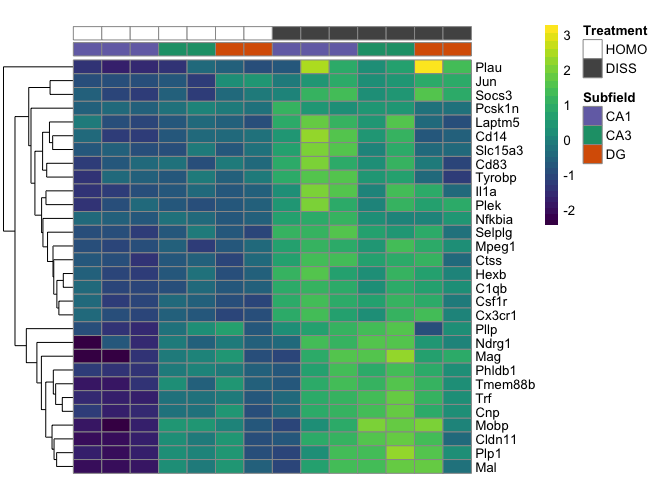

Here is the function I wrote to make two heatmaps, one a png and one a
pdf. The goal is to have the ~ top X number of genes that are
differentially expressed according to treatment.

    dissocation_DEGes <- read.csv("../results/01_dissociation_DEGes.csv", header = T, check.names = F)
    dissocation_df <-read.csv("../results/01_dissociation_colData.csv", header = T, row.names = 1)
    dissocation_df <- dissocation_df %>% dplyr::select(Subfield, Treatment)
    head(dissocation_DEGes)

    ##   100-CA1-1 100-CA1-2 100-CA1-3 100-CA3-1 100-CA3-4 100-DG-2 100-DG-3
    ## 1  4.588506  4.776457  4.853057  5.079028  5.171328 5.186172 5.030617
    ## 2  3.186440  3.699914  3.130243  3.602998  3.097215 3.642540 3.482691
    ## 3  1.776934  2.360120  1.673957  2.380223  2.128380 1.829261 2.487685
    ## 4  4.783898  5.300681  5.179514  5.568535  5.426965 5.580094 5.249916
    ## 5  5.359882  5.526377  5.473584  5.223632  5.489882 5.497304 5.372749
    ## 6  3.423956  3.611552  3.487061  3.361672  3.693182 3.564731 3.908437
    ##   101-CA1-1 101-CA1-2 101-CA1-3 101-CA3-1 101-CA3-4 101-DG-3 101-DG-4
    ## 1  4.955175  4.217261  3.466905  5.086613  5.019213 5.439691 4.155567
    ## 2  3.304835  4.260577  2.711435  3.820068  3.477413 4.200692 2.744500
    ## 3  2.039003  1.952140  1.795752  2.240397  1.916907 3.161293 3.000009
    ## 4  5.474983  5.045292  5.180087  5.555603  5.284525 6.004003 4.967042
    ## 5  4.998284  5.438165  5.471275  4.734139  5.658483 5.410605 4.640979
    ## 6  3.962612  3.763709  2.758099  2.486961  2.843938 3.776848 4.429753
    ##   pvalTreatmentDISSHOMO padjTreatmentDISSHOMO      rownames   padjmin
    ## 1             0.4754745             0.8680052 0610007P14Rik 0.8680052
    ## 2             0.7687923             0.9591621 0610009B22Rik 0.9591621
    ## 3             0.7648386             0.9574803 0610009L18Rik 0.9574803
    ## 4             0.6083141             0.9172761 0610009O20Rik 0.9172761
    ## 5             0.5907161             0.9122632 0610010F05Rik 0.9122632
    ## 6             0.6973840             0.9401399 0610010K14Rik 0.9401399

    head(dissocation_df)

    ##           Subfield Treatment
    ## 100-CA1-1      CA1      HOMO
    ## 100-CA1-2      CA1      HOMO
    ## 100-CA1-3      CA1      HOMO
    ## 100-CA3-1      CA3      HOMO
    ## 100-CA3-4      CA3      HOMO
    ## 100-DG-2        DG      HOMO

    Heatmaps <- function(DEGes, ann_colors, df, main){
      
        myfile <-  paste("../figures/04_heatmaps/", substitute(DEGes), ".pdf", sep="")
      
      DEGes <- DEGes[order(DEGes$padjmin),]
      DEGes <- head(DEGes, 30)
      print(head(DEGes, 30))

     rownames(DEGes) <- DEGes$rownames
    drop.cols <-colnames(DEGes[,grep("padj|pval|rownames", colnames(DEGes))])
    DEGes <- DEGes %>% select(-one_of(drop.cols))
    DEGes <- as.matrix(DEGes)
    DEGes <- DEGes - rowMeans(DEGes)

      paletteLength <- 30
      myBreaks <- c(seq(min(DEGes), 0, length.out=ceiling(paletteLength/2) + 1), 
                  seq(max(DEGes)/paletteLength, max(DEGes), length.out=floor(paletteLength/2)))
      
    pheatmap(DEGes, show_colnames=F, show_rownames = T,
             annotation_col=df, annotation_colors = ann_colors, 
             annotation_row = NA, annotation_legend = FALSE,
             annotation_names_row = FALSE, annotation_names_col = FALSE,
             border_color = "grey60" ,
             color = viridis(30),
             clustering_method="average",
             breaks=myBreaks,
             clustering_distance_cols="correlation", 
             cluster_cols = F,
             main = main)  

    pheatmap(DEGes, show_colnames=F, show_rownames = T,
             annotation_col=df, annotation_colors = ann_colors, 
             annotation_row = NA, annotation_legend = TRUE,
             annotation_names_row = FALSE, annotation_names_col = TRUE,
             treeheight_row = 0, treeheight_col = 10,
             fontsize = 7, 
             border_color = "grey60" ,
             color = viridis(30),
             width=3.5, height=3.25,
             clustering_method="average",
             breaks=myBreaks,
             clustering_distance_cols="correlation", 
             cluster_cols = F,
             main = main,
             filename =  myfile)
    }

    #colorpalette
    dissocation_colors <- list(Treatment = c(HOMO = (values=c("#ffffff")), 
                                             DISS = (values=c("#525252"))),
                               Subfield = c(CA1 = (values=c("#7570b3")),
                                            CA3 = (values=c("#1b9e77")), 
                                            DG = (values=c("#d95f02"))))

    # uses above "Heatmaps" function
    # usage: name of matrix, color palette, lengend, title
    Heatmaps(dissocation_DEGes, dissocation_colors, dissocation_df, "Cellular Dissociation")

    ##       100-CA1-1 100-CA1-2 100-CA1-3 100-CA3-1 100-CA3-4  100-DG-2 100-DG-3
    ## 15098  6.678934  6.455184  6.585966  8.021705  8.064551  8.194074 7.462162
    ## 6785   6.794035  6.431081  6.271556  6.650495  7.124863  6.557294 6.818164
    ## 12780  4.627414  4.682585  4.402144  4.847268  5.556670  4.942808 4.512466
    ## 1994   5.832387  5.187313  5.270997  5.448560  5.891399  5.629711 5.663645
    ## 3387   7.177886  6.356077  6.475488  7.079481  7.001363  6.618541 6.447271
    ## 3476   6.037049  5.730294  5.337531  5.989075  6.092079  5.642399 6.254192
    ## 3089   6.447650  6.014109  6.196619  7.578962  7.553176  8.117013 6.923475
    ## 7304   5.086678  5.198479  5.567193  5.748938  6.015899  5.661461 5.910482
    ## 8431   4.684608  4.704782  5.821968  7.053418  7.240844  7.495531 6.180667
    ## 2458   4.608963  3.759320  3.751164  4.376975  4.639430  4.661866 4.803785
    ## 8973   4.903705  4.614858  4.796536  5.121998  4.558883  4.970169 5.378023
    ## 14867  4.305368  4.261661  4.750792  6.527795  5.677167  6.611131 5.626322
    ## 9623   4.894103  4.784166  4.497308  4.999636  4.869189  4.542968 4.704600
    ## 13107  3.421756  3.581781  3.232164  3.371265  4.132324  3.495169 3.905098
    ## 2522   5.340416  5.883941  6.185763  6.378681  5.706299  6.485671 6.274939
    ## 2957   4.511400  4.392688  4.803760  6.773297  6.451795  7.020057 5.622021
    ## 7999   6.307229  5.580425  5.368546  5.683108  6.066981  5.833614 5.474855
    ## 10873  3.537005  3.185800  3.461271  3.621444  4.626296  4.346621 4.157606
    ## 10950  8.197618  7.916057  8.197962 10.129203 10.087867 10.383412 9.144717
    ## 8448   4.845905  4.997144  5.013703  7.294917  6.918571  7.521731 6.339533
    ## 10902  4.983363  5.471546  5.991482  5.728349  5.559300  5.669340 5.809947
    ## 7582   7.837542  7.898360  7.938662  8.040500  7.545653  8.947308 9.335772
    ## 8941   7.050145  6.555754  7.254890  9.300306  9.304803  9.053520 8.277869
    ## 10483  8.823577  8.983482  8.801554  9.237269  9.500806  9.312143 9.220214
    ## 13625  5.516770  5.105939  4.955877  5.565665  4.899733  5.727830 5.979085
    ## 10945  4.696966  4.200416  4.032983  5.348246  5.797689  6.291268 4.997152
    ## 9485   3.618052  5.306158  4.519929  5.914599  5.534872  5.963641 5.437148
    ## 10717  6.265663  6.077326  6.064873  7.317581  7.425536  7.364844 6.872591
    ## 15431  2.455985  3.394467  3.285141  3.048998  3.705149  3.271912 3.775432
    ## 3512   6.207898  5.570140  5.518497  5.905295  5.771442  5.470151 5.642099
    ##       101-CA1-1 101-CA1-2 101-CA1-3 101-CA3-1 101-CA3-4  101-DG-3
    ## 15098  7.907247  9.081183  9.465771  9.667109 10.024013  9.382196
    ## 6785   8.542571  8.909308  8.034153  7.697114  8.490399  8.148864
    ## 12780  6.646902  6.640339  7.222901  6.352122  6.157988  6.587091
    ## 1994   7.258442  7.473617  7.165813  6.501372  7.162033  7.012938
    ## 3387   8.356753  8.862489  8.438354  8.129928  8.587691  8.407206
    ## 3476   7.361882  8.149849  8.082421  7.310944  7.676637  7.780814
    ## 3089   7.313843  8.559544  8.786797  8.997388  9.464784  8.594701
    ## 7304   6.589388  8.438276  7.907140  6.424911  7.725533  7.351689
    ## 8431   6.051258  8.144527  8.632042  8.792537  9.296406  7.797461
    ## 2458   5.405453  7.303050  6.596211  5.549786  6.178925  4.369546
    ## 8973   6.434715  6.831222  6.674835  6.259687  7.106518  6.632660
    ## 14867  5.514359  7.180026  7.485010  7.293594  7.824322  7.285353
    ## 9623   6.089258  6.240287  6.527532  5.564985  5.365749  5.411022
    ## 13107  4.971780  6.167702  5.766776  4.231340  5.123136  3.769530
    ## 2522   7.410896  8.751718  7.469221  6.824263  7.660741  6.564128
    ## 2957   5.706858  7.486073  7.551711  8.160657  8.382775  7.729045
    ## 7999   7.315176  8.242019  7.504689  6.918436  7.979523  5.960906
    ## 10873  4.189893  7.392443  5.823646  5.190704  5.653127  8.262145
    ## 10950  8.944428 10.174152 11.395046 11.461427 12.167488 11.499130
    ## 8448   5.863537  7.642481  8.343837  8.258539  8.856700  8.843846
    ## 10902  6.814492  8.358697  7.264754  6.476434  7.518107  7.065921
    ## 7582   8.653407  9.265493  9.781279  8.976552  9.298623  9.738856
    ## 8941   7.823447  9.290912  9.943513 10.953246 10.684668 10.944592
    ## 10483 10.458562  9.849150  9.560152  9.859101  9.908938  9.116378
    ## 13625  6.166339  7.219555  7.462153  6.298145  6.475735  7.613239
    ## 10945  5.892752  6.376219  6.841790  6.897343  7.132386  4.781813
    ## 9485   5.671739  7.475814  7.211012  7.639956  7.613526  6.565426
    ## 10717  6.716385  7.996681  8.787638  8.319790  8.727497  8.385980
    ## 15431  4.734212  5.338789  5.313698  4.268017  4.434289  3.443171
    ## 3512   7.338130  7.935255  7.286386  6.720068  7.589266  7.926436
    ##        101-DG-4 pvalTreatmentDISSHOMO padjTreatmentDISSHOMO rownames
    ## 15098  8.450112          4.363497e-11          5.304704e-07      Trf
    ## 6785   7.514103          1.332509e-10          8.099655e-07     Hexb
    ## 12780  5.288674          2.276293e-10          9.224297e-07   Selplg
    ## 1994   6.493649          2.329283e-09          7.079273e-06     C1qb
    ## 3387   7.361839          4.728833e-09          9.581403e-06    Csf1r
    ## 3476   6.339071          4.320121e-09          9.581403e-06     Ctss
    ## 3089   7.991943          3.309524e-08          4.470431e-05      Cnp
    ## 7304   6.036578          2.751396e-08          4.470431e-05     Il1a
    ## 8431   8.043009          3.028665e-08          4.470431e-05      Mag
    ## 2458   4.518618          4.010293e-08          4.875314e-05     Cd14
    ## 8973   5.853311          5.856371e-08          6.472354e-05    Mpeg1
    ## 14867  6.395530          6.678658e-08          6.766037e-05  Tmem88b
    ## 9623   5.771279          7.341076e-08          6.865035e-05   Nfkbia
    ## 13107  3.769958          1.073750e-07          9.323989e-05  Slc15a3
    ## 2522   5.615348          1.230957e-07          9.976494e-05     Cd83
    ## 2957   6.086318          1.377689e-07          1.046785e-04   Cldn11
    ## 7999   5.578559          3.457177e-07          2.234181e-04   Laptm5
    ## 10873  6.338971          3.348184e-07          2.234181e-04     Plau
    ## 10950 10.249626          3.491769e-07          2.234181e-04     Plp1
    ## 8448   6.767767          3.849769e-07          2.316729e-04      Mal
    ## 10902  7.285833          4.001917e-07          2.316729e-04     Plek
    ## 7582   9.665210          5.788592e-07          3.198723e-04      Jun
    ## 8941   9.057475          8.334682e-07          4.405423e-04     Mobp
    ## 10483  9.097678          9.583279e-07          4.796180e-04   Pcsk1n
    ## 13625  6.944661          9.863000e-07          4.796180e-04    Socs3
    ## 10945  5.874721          1.168586e-06          5.464037e-04     Pllp
    ## 9485   6.076311          1.285641e-06          5.788719e-04    Ndrg1
    ## 10717  7.582320          1.576085e-06          6.843024e-04   Phldb1
    ## 15431  2.578036          1.961782e-06          8.223926e-04   Tyrobp
    ## 3512   6.646653          2.422845e-06          9.501459e-04   Cx3cr1
    ##            padjmin
    ## 15098 5.304704e-07
    ## 6785  8.099655e-07
    ## 12780 9.224297e-07
    ## 1994  7.079273e-06
    ## 3387  9.581403e-06
    ## 3476  9.581403e-06
    ## 3089  4.470431e-05
    ## 7304  4.470431e-05
    ## 8431  4.470431e-05
    ## 2458  4.875314e-05
    ## 8973  6.472354e-05
    ## 14867 6.766037e-05
    ## 9623  6.865035e-05
    ## 13107 9.323989e-05
    ## 2522  9.976494e-05
    ## 2957  1.046785e-04
    ## 7999  2.234181e-04
    ## 10873 2.234181e-04
    ## 10950 2.234181e-04
    ## 8448  2.316729e-04
    ## 10902 2.316729e-04
    ## 7582  3.198723e-04
    ## 8941  4.405423e-04
    ## 10483 4.796180e-04
    ## 13625 4.796180e-04
    ## 10945 5.464037e-04
    ## 9485  5.788719e-04
    ## 10717 6.843024e-04
    ## 15431 8.223926e-04
    ## 3512  9.501459e-04

