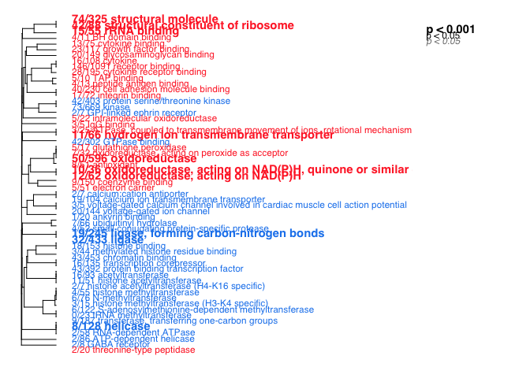
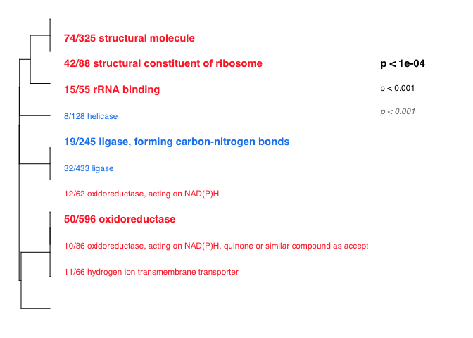
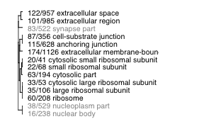
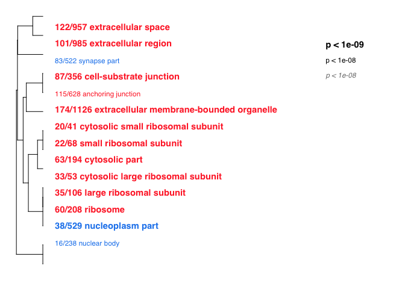

GO\_MWU uses continuous measure of significance (such as fold-change or
-log(p-value) ) to identify GO categories that are significantly
enriches with either up- or down-regulated genes. The advantage - no
need to impose arbitrary significance cutoff.

If the measure is binary (0 or 1) the script will perform a typical "GO
enrichment" analysis based Fisher's exact test: it will show GO
categories over-represented among the genes that have 1 as their
measure.

On the plot, different fonts are used to indicate significance and color
indicates enrichment with either up (red) or down (blue) regulated
genes. No colors are shown for binary measure analysis.

The tree on the plot is hierarchical clustering of GO categories based
on shared genes. Categories with no branch length between them are
subsets of each other.

The fraction next to GO category name indicates the fracton of "good"
genes in it; "good" genes being the ones exceeding the arbitrary
absValue cutoff (option in gomwuPlot). For Fisher's based test, specify
absValue=0.5. This value does not affect statistics and is used for
plotting only.

Stretch the plot manually to match tree to text

Mikhail V. Matz, UT Austin, February 2015; <matz@utexas.edu>

################################################################ 

NOTES: This program drains memory and creates some very large
intermediate files, especially for the biological process catagory.

First, I run the stats from the command line to make sure its working.
Once I've generated the temp files, I comment out then stats portions
and recreate the plots by kniting the rmd file.

    library(ape)
    source("gomwu.functions.R")

    # set output file for figures 
    knitr::opts_chunk$set(fig.path = '../../figures/05_GO_MMU/',
                         eval=F, include=F)

Dissociation vs Homogenization Molecular Function (MF)
------------------------------------------------------

    # input files
    input="01_dissociation_GOpvals.csv" 
    goAnnotations="goAnnotations.tab" 
    goDatabase="go.obo" 
    goDivision="MF" # either MF, or BP, or CC

    # Calculating stats
    #gomwuStats(input, goDatabase, goAnnotations, goDivision, perlPath="perl", largest=0.1, smallest=5,clusterCutHeight=0.25)  

    # many catagories
    gomwuPlot(input,goAnnotations,goDivision,
        absValue=-log(0.05,10),  
        level1=0.01, 
        level2=0.01, 
        level3=0.001, 
        txtsize=1.4,    
        treeHeight=0.5, 
      #colors=c("#d9d9d9","#525252","#d9d9d9","#525252")
        #colors=c("blue","green","blue","green") 
        colors=c("dodgerblue2","firebrick1","skyblue","lightcoral") 
    )

    ## Warning in plot.formula(c(1:top) ~ c(1:top), type = "n", axes = F, xlab =
    ## "", : the formula 'c(1:top) ~ c(1:top)' is treated as 'c(1:top) ~ 1'

    ## Warning in plot.formula(c(1:top) ~ c(1:top), type = "n", axes = F, xlab =
    ## "", : the formula 'c(1:top) ~ c(1:top)' is treated as 'c(1:top) ~ 1'

    ## GO terms dispayed:  25 
    ## "Good genes" accounted for:  371 out of 1025 ( 36% )

    # fewer catagories
    gomwuPlot(input,goAnnotations,goDivision,
        absValue=-log(0.05,10),  
        level1=0.001, 
        level2=0.001, 
        level3=0.0001, 
        txtsize=1.4,    
        treeHeight=0.5, 
      #colors=c("#d9d9d9","#525252","#d9d9d9","#525252")
        #colors=c("blue","green","blue","green") 
        colors=c("dodgerblue2","firebrick1","skyblue","lightcoral") 
    )

    ## Warning in plot.formula(c(1:top) ~ c(1:top), type = "n", axes = F, xlab =
    ## "", : the formula 'c(1:top) ~ c(1:top)' is treated as 'c(1:top) ~ 1'

    ## Warning in plot.formula(c(1:top) ~ c(1:top), type = "n", axes = F, xlab =
    ## "", : the formula 'c(1:top) ~ c(1:top)' is treated as 'c(1:top) ~ 1'

    ## GO terms dispayed:  10 
    ## "Good genes" accounted for:  176 out of 1025 ( 17% )

Dissociation vs Homogenization Molecular Function (MF)
------------------------------------------------------

    # input files
    input="01_dissociation_GOpvals.csv" 
    goAnnotations="goAnnotations.tab" 
    goDatabase="go.obo" 
    goDivision="CC" # either MF, or BP, or CC

    # Calculating stats
    #gomwuStats(input, goDatabase, goAnnotations, goDivision, perlPath="perl", largest=0.1, smallest=5,clusterCutHeight=0.25)  

    # Data viz
    gomwuPlot(input,goAnnotations,goDivision,
        absValue=-log(0.05,10),  
        level1=0.0000001, 
        level2=0.0000001, 
        level3=0.00000001, 
        txtsize=1.4,    
        treeHeight=0.5, 
      #colors=c("#d9d9d9","#525252","#d9d9d9","#525252")
        #colors=c("blue","green","blue","green") 
        colors=c("dodgerblue2","firebrick1","skyblue","lightcoral") 
    )

    ## Warning in plot.formula(c(1:top) ~ c(1:top), type = "n", axes = F, xlab =
    ## "", : the formula 'c(1:top) ~ c(1:top)' is treated as 'c(1:top) ~ 1'

    ## Warning in plot.formula(c(1:top) ~ c(1:top), type = "n", axes = F, xlab =
    ## "", : the formula 'c(1:top) ~ c(1:top)' is treated as 'c(1:top) ~ 1'

    ## GO terms dispayed:  19 
    ## "Good genes" accounted for:  557 out of 1084 ( 51% )

    gomwuPlot(input,goAnnotations,goDivision,
        absValue=-log(0.05,10),  
        level1=0.00000001, 
        level2=0.00000001, 
        level3=0.000000001, 
        txtsize=1.4,    
        treeHeight=0.5, 
      #colors=c("#d9d9d9","#525252","#d9d9d9","#525252")
        #colors=c("blue","green","blue","green") 
        colors=c("dodgerblue2","firebrick1","skyblue","lightcoral") 
    )

    ## Warning in plot.formula(c(1:top) ~ c(1:top), type = "n", axes = F, xlab =
    ## "", : the formula 'c(1:top) ~ c(1:top)' is treated as 'c(1:top) ~ 1'

    ## Warning in plot.formula(c(1:top) ~ c(1:top), type = "n", axes = F, xlab =
    ## "", : the formula 'c(1:top) ~ c(1:top)' is treated as 'c(1:top) ~ 1'

    ## GO terms dispayed:  14 
    ## "Good genes" accounted for:  475 out of 1084 ( 44% )
