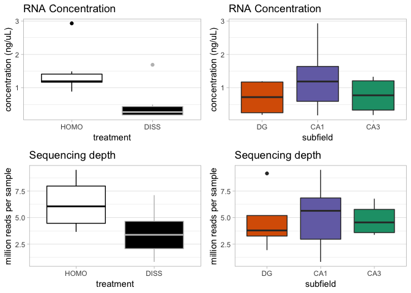

    library(ggplot2)
    library(cowplot)

    ## 
    ## Attaching package: 'cowplot'

    ## The following object is masked from 'package:ggplot2':
    ## 
    ##     ggsave

    knitr::opts_chunk$set(fig.path = '../figures/06_readcounts/')

Thankfully, the Genome Sequencing and Analysis Facility maintaines
friendly webarchive of sample information long after samples are
processed. This included a table of reads per sample and any quality
conrol data.

RNA concentation in each sample
-------------------------------

    rnaconcentration <- read.csv("../results/picogreen.csv")
    summary(rnaconcentration)

    ##        sample    picograms      treatment
    ##  100-CA1-1:1   Min.   : 173.0   DISS:7   
    ##  100-CA1-2:1   1st Qu.: 299.8   HOMO:7   
    ##  100-CA1-3:1   Median :1026.5            
    ##  100-CA3-1:1   Mean   : 967.6            
    ##  100-CA3-4:1   3rd Qu.:1296.0            
    ##  100-DG-2 :1   Max.   :2931.0            
    ##  (Other)  :8

    # format data
    rnaconcentration$nanograms <- (rnaconcentration$picograms)/1000 

    rnaconcentration$treatment <- factor(rnaconcentration$treatment, levels = c("HOMO", "DISS"))

    a <- ggplot(rnaconcentration, aes(x = treatment, y = nanograms, 
                      fill = treatment, color = treatment)) + 
      geom_boxplot() +
      scale_fill_manual(values = c("white", "black")) +
      scale_color_manual(values = c("black", "grey")) +
      theme_cowplot(font_size = 12, line_size = 0.25) +
      labs(y = "nanograms reads per sample",
           title = "RNA Concentration") +
      theme_light() +
        theme(legend.position = "none",
              panel.grid.major.x = element_blank()) 

    t.test(rnaconcentration$nanograms~rnaconcentration$treatment)

    ## 
    ##  Welch Two Sample t-test
    ## 
    ## data:  rnaconcentration$nanograms by rnaconcentration$treatment
    ## t = 2.9491, df = 11.475, p-value = 0.0127
    ## alternative hypothesis: true difference in means is not equal to 0
    ## 95 percent confidence interval:
    ##  0.2494507 1.6885493
    ## sample estimates:
    ## mean in group HOMO mean in group DISS 
    ##          1.4521429          0.4831429

Counts per Sample
-----------------

Counts per sample is provided by the GSAF. Alternatively, you can use
this bash forloop to count the reads yourself.

    for file in *R1_001.fastq.gz
    do
    echo $file
    zcat $file | echo $((`wc -l`/4)) 
    done 

A table of sample and read counts was save in
`../results/readcounts.txt`.

    reads <- read.table("../results/readcounts.txt", header = T)
    summary(reads)

    ##         name       counts        treatment
    ##  100_CA1_1:1   Min.   : 831222   DISS:7   
    ##  100_CA1_2:1   1st Qu.:3447633   HOMO:7   
    ##  100_CA1_3:1   Median :4547688            
    ##  100_CA3_1:1   Mean   :4918879            
    ##  100_CA3_4:1   3rd Qu.:6600756            
    ##  100_DG_2 :1   Max.   :9496400            
    ##  (Other)  :8

    # format data
    reads$millionreads <- (reads$counts)/1000000 # to show in millions
    reads$treatment <- factor(reads$treatment, levels = c("HOMO", "DISS"))

    # basic stats
    mean(reads$millionreads) 

    ## [1] 4.918879

    sd(reads$millionreads)

    ## [1] 2.606619

    b <- ggplot(reads, aes(x = treatment, y = millionreads, 
                      fill = treatment, color = treatment)) + 
      geom_boxplot() +
      scale_fill_manual(values = c("white", "black")) +
      scale_color_manual(values = c("black", "grey")) +
      theme_cowplot(font_size = 12, line_size = 0.25) +
      labs(y = "million reads per sample",
           title = "Sequencing depth") +
      theme_light() +
        theme(legend.position = "none",
              panel.grid.major.x = element_blank()) 

    t.test(reads$millionreads~reads$treatment)

    ## 
    ##  Welch Two Sample t-test
    ## 
    ## data:  reads$millionreads by reads$treatment
    ## t = 2.2738, df = 11.909, p-value = 0.0423
    ## alternative hypothesis: true difference in means is not equal to 0
    ## 95 percent confidence interval:
    ##  0.1129073 5.4003561
    ## sample estimates:
    ## mean in group HOMO mean in group DISS 
    ##           6.297195           3.540563

On average, my samples yielded 4.9 +/- 2.6 million reads.

    plot_grid(a,b)

    aligned <- read.table("../results/pseudoaligned_clean.txt", header = T)

    aligned$percent <- (aligned$pseudoaligned / aligned$processed) * 100
    summary(aligned)

    ##    processed       pseudoaligned        percent      
    ##  Min.   : 313015   Min.   :  65987   Min.   : 5.419  
    ##  1st Qu.:1479506   1st Qu.: 748285   1st Qu.:49.000  
    ##  Median :2958364   Median :2128611   Median :70.112  
    ##  Mean   :3302250   Mean   :2324577   Mean   :61.233  
    ##  3rd Qu.:3434580   3rd Qu.:2464398   3rd Qu.:74.323  
    ##  Max.   :8513137   Max.   :6653688   Max.   :79.540

    mean(aligned$percent)

    ## [1] 61.23341

    sd(aligned$percent)

    ## [1] 20.84956

On average, 61.2% +/1 20.8% of the trimmed reads were psuedoaligned to
the transcriptome.

MultiQC
-------

Here are the results QC before and after filtering and trimming reads

Before 

After 
