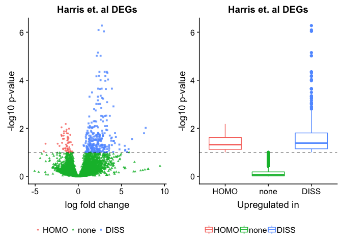
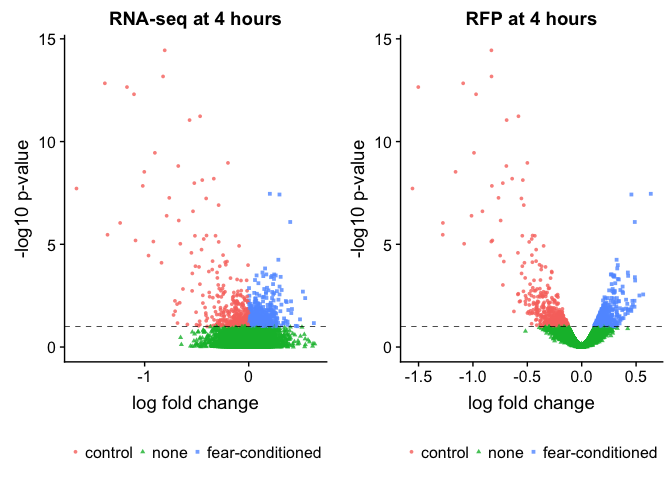
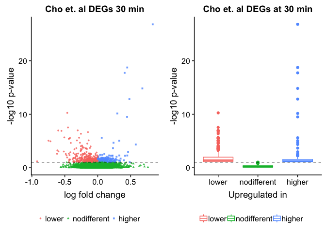

This script identifies to differntially expreseed genes from Cho et al.
(`../data/aac7368-Cho.SM.Table.S2.xls` from Andre Fenton) and asks if
there is any overlap in the the differentially expressed genes in their
study compared to mine.

### functions for data viz

### Harris et al. data

    ##  DISS  HOMO  none 
    ##   288    56 11813

### Cho et al. data at 4 hours

    ##       lower nodifferent      higher 
    ##         435       10503         593

### Overlaping DEGs between Harris et al. and Cho et al at 4 hours post treatment

    ##  [1] "gene"        "lfc.x"       "log10p"      "pvalue.x"    "Description"
    ##  [6] "direction.x" "pvalue.y"    "lfc.y"       "padj"        "direction.y"

    ##     gene    Cho Harris   log10p
    ## 1   Plau higher   DISS 1.191287
    ## 2 Slc2a5 higher   DISS 1.212306
    ## 3 Selplg higher   DISS 1.556865
    ## 4    Fn1 higher   DISS 3.416128
    ##                                                         Description
    ## 1                    urokinase-type plasminogen activator precursor
    ## 2 solute carrier family 2, facilitated glucose transporter member 5
    ## 3                        P-selectin glycoprotein ligand 1 precursor
    ## 4                                   fibronectin isoform a precursor

### Cho et al. data at 30 min

    ##       lower nodifferent      higher 
    ##         338       10932         261

### Overlaping DEGs between Harris et al. and Cho et al at 30 min post treatment

    ##      gene    Cho Harris    log10p                            Description
    ## 1    Cdh9 higher   DISS  1.072904                   cadherin-9 precursor
    ## 2     Fn1 higher   DISS  1.180076        fibronectin isoform a precursor
    ## 3   Ostf1 higher   DISS  1.315947        osteoclast-stimulating factor 1
    ## 4    Ctss higher   DISS  1.485500    cathepsin S isoform 1 preproprotein
    ## 5  Csrnp1 higher   DISS  1.518961 cysteine/serine-rich nuclear protein 1
    ## 6    Btg2 higher   DISS  2.254590                           protein BTG2
    ## 7  Nfkbia higher   DISS  3.666476             NF-kappa-B inhibitor alpha
    ## 8   Dusp1 higher   DISS  4.671673 dual specificity protein phosphatase 1
    ## 9    Junb higher   DISS  9.499079             transcription factor jun-B
    ## 10   Fosb higher   DISS 12.831460                           protein fosB

### Details

<https://www.ncbi.nlm.nih.gov/geo/query/acc.cgi?acc=GSE72064>

Genome-wide profilings of transcriptome and translatome in mouse
hippocampi after contextual fear conditioning

Memory stabilization after learning requires transcriptional and
translational regulations in the brain, yet the temporal molecular
changes following learning have not been explored at the genomic scale.
We here employed ribosome profiling and RNA sequencing to quantify the
translational status and transcript levels in mouse hippocampus
following contextual fear conditioning. We identified 104 genes that are
dynamically regulated. Intriguingly, our analysis revealed novel
repressive regulations in the hippocampus: translational suppression of
ribosomal protein-coding genes at basal state; learning-induced early
translational repression of specific genes; and late persistent
suppression of a subset of genes via inhibition of ESR1/ERα signaling.
Further behavioral analyses revealed that Nrsn1, one of the newly
identified genes undergoing rapid translational repression, can act as a
memory suppressor gene. This study unveils the yet unappreciated
importance of gene repression mechanisms in memory formation.
