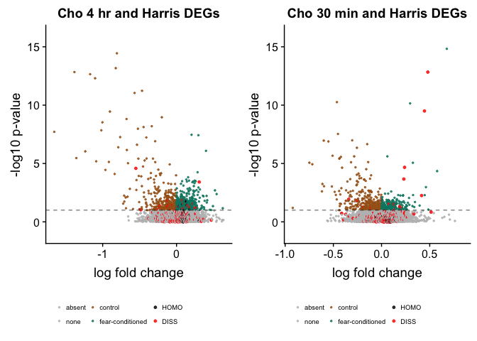

Cho et al 2015 used RNA sequencing to quantify transcript levels in the
mouse hippocampus after contextual fear conditioning. The Cho dataset
provides a snapshot of gene expression changes associated with
hippocampal learning and memory 30 min and 4 h after an experiment. The
Cho data are available at
<http://science.sciencemag.org/content/suppl/2015/09/30/350.6256.82.DC1>
and <https://www.ncbi.nlm.nih.gov/geo/query/acc.cgi?acc=GSE72064>. The
file `../data/aac7368-Cho.SM.Table.S2.xls` of differentially expressed
genes was used as a representative dataset for learning and memory
associated gene expression patterns.

In this analysis, I compared the Cho et al differentially expressed
genes (DEGs) to my experimental results (referred to as the Harris data)
to identify the interaction between genes that are differentially
expressed following fear condition and following a chemical
manipulation.

This analysis prints the list of genes that are differentially expressed
in both experiments. The images show that only a few (red dots) of genes
that respond to chemical dissociation are up-regulated or down-regulated
following fear-conditioning.

[Click here to view the source code.](./08-genelists.Rmd)

    ##  HOMO  none  DISS 
    ##    56 11813   288

    ##          control             none fear-conditioned 
    ##              435            10503              593

    ##      gene      lfc.x   log10p
    ## 1   Enpp2 -0.3408160 1.936722
    ## 2   Ltbp3 -0.1067284 1.164107
    ## 3 Rps6kb2 -0.1845210 1.280416
    ## 4    Ucp2 -0.2512070 1.855474

    ##      gene       lfc.x    log10p
    ## 1    Btg2 0.415512601  2.254590
    ## 2    Cdh9 0.145703285  1.072904
    ## 3  Csrnp1 0.129921418  1.518961
    ## 4    Ctss 0.136457163  1.485500
    ## 5   Dusp1 0.239038162  4.671673
    ## 6     Fn1 0.208424628  1.180076
    ## 7    Fosb 0.480139425 12.831460
    ## 8    Junb 0.445263070  9.499079
    ## 9  Nfkbia 0.231310401  3.666476
    ## 10  Ostf1 0.188375932  1.315947
    ## 11 Rpl36a 0.003817734  1.836303
    ## 12 Stk32b 0.078390160  1.526246

    ##      gene       lfc.x   log10p
    ## 1   Arl4c -0.07732208 1.050381
    ## 2   Crtc2 -0.00735876 1.052088
    ## 3    Cyba -0.24420868 1.081165
    ## 4   Dusp1 -0.22502672 1.330345
    ## 5   Enpp2 -0.55053850 4.584654
    ## 6    Junb -0.09760299 1.443716
    ## 7    Lcp1 -0.06590935 1.039733
    ## 8    Myrf -0.05238512 1.413227
    ## 9   Pold1 -0.11969951 1.316293
    ## 10 Sh3d19 -0.12096231 1.856375
    ## 11   Ucp2 -0.48218129 1.035224

    ##      gene       lfc.x   log10p
    ## 1    C1qa 0.108203614 1.213410
    ## 2    C1qb 0.035511062 1.240421
    ## 3    C1qc 0.095608573 1.837891
    ## 4  Cldn11 0.077263632 1.155499
    ## 5   Csf1r 0.090316556 1.123621
    ## 6    Ctss 0.112020397 1.097359
    ## 7     Fn1 0.307183898 3.416128
    ## 8   Icam1 0.002957341 1.161201
    ## 9   Lamb2 0.028780181 1.321626
    ## 10   Mobp 0.164821030 1.444639
    ## 11   Plau 0.266182383 1.191287
    ## 12  Pros1 0.179075205 1.231081
    ## 13  Rpl23 0.107588915 1.142111
    ## 14 Rps27a 0.078980614 1.855251
    ## 15 Selplg 0.223605357 1.556865
    ## 16 Sema5a 0.160959212 1.325216
    ## 17 Slc2a1 0.159775081 1.447714
    ## 18 Slc2a5 0.251077680 1.212306
    ## 19  Smoc2 0.092926831 1.573106
    ## 20  Spry2 0.193122686 1.255623

    ## 'data.frame':    13127 obs. of  11 variables:
    ##  $ gene       : chr  "Cdkn1c" "Ltc4s" "Epn3" "1500015O10Rik" ...
    ##  $ lfc.x      : num  -0.921 -0.749 -0.718 -0.618 -0.613 ...
    ##  $ log10p     : num  1.2 5.07 4.94 2.61 3.24 ...
    ##  $ pvalue.x   : num  6.35e-02 8.58e-06 1.16e-05 2.45e-03 5.70e-04 ...
    ##  $ Description: chr  "cyclin-dependent kinase inhibitor 1C isoform 1" "leukotriene C4 synthase" "epsin-3" "augurin precursor" ...
    ##  $ Cho        : chr  "control" "control" "control" "control" ...
    ##  $ pvalue.y   : num  NA 0.939 NA NA NA ...
    ##  $ lfc.y      : num  NA 4.08 NA NA NA ...
    ##  $ padj       : num  NA 0.115 NA NA NA ...
    ##  $ Harris     : chr  "absent" "none" "absent" "absent" ...
    ##  $ color      : Factor w/ 6 levels "absent","none",..: 3 3 3 3 3 3 3 2 2 3 ...

