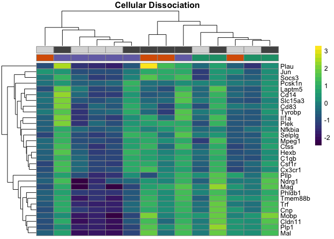
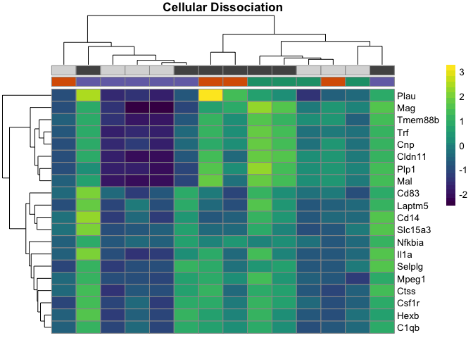
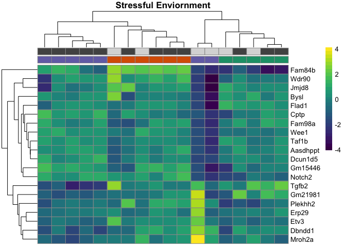
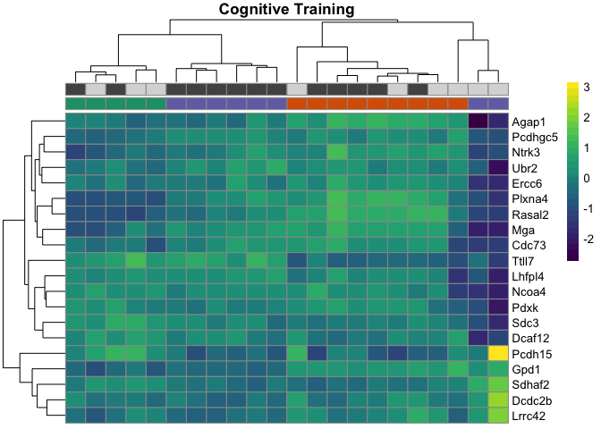

Here is the function I wrote to make two heatmaps, one a png and one a
pdf. The goal is to have the ~ top X number of genes that are
differentially expressed according to treatment.

    dissocation_DEGes <- read.csv("../results/01_dissociation_DEGes.csv", header = T, check.names = F)
    dissocation_df <-read.csv("../results/01_dissociation_colData.csv", header = T, row.names = 1)
    dissocation_df <- dissocation_df %>% dplyr::select(Subfield, Treatment)

    stress_DEGes <- read.csv("../results/02_stress_DEGes.csv", header = T, check.names = F)
    stress_df <-read.csv("../results/02_stress_colData.csv", header = T, row.names = 1)
    stress_df <- stress_df %>% dplyr::select(Subfield, Treatment)

    cognition_DEGes <- read.csv("../results/03_cognition_DEGes.csv", header = T, check.names = F)
    cognition_df <-read.csv("../results/03_cognition_colData.csv", header = T, row.names = 1)
    cognition_df <- cognition_df %>% dplyr::select(Subfield, Treatment)

    cembrowski_DEGes <- read.csv("../results/04_cembrowksi_DEGes.csv", header = T)
    cembrowski_df <- read.csv("../results/04_cembrowksi_colData.csv", header = T, row.names = 1)

    Heatmaps <- function(DEGes, ann_colors, df, main){
      
        myfile <-  paste("../figures/heatmaps/", substitute(DEGes), ".pdf", sep="")
      
      DEGes <- DEGes[order(DEGes$padjmin),]
      DEGes <- head(DEGes, 30)
      head(DEGes, 30)

     rownames(DEGes) <- DEGes$rownames
    drop.cols <-colnames(DEGes[,grep("padj|pval|rownames", colnames(DEGes))])
    DEGes <- DEGes %>% select(-one_of(drop.cols))
    DEGes <- as.matrix(DEGes)
    DEGes <- DEGes - rowMeans(DEGes)

      paletteLength <- 30
      myBreaks <- c(seq(min(DEGes), 0, length.out=ceiling(paletteLength/2) + 1), 
                  seq(max(DEGes)/paletteLength, max(DEGes), length.out=floor(paletteLength/2)))
      
    pheatmap(DEGes, show_colnames=F, show_rownames = T,
             annotation_col=df, annotation_colors = ann_colors, 
             annotation_row = NA, annotation_legend = FALSE,
             annotation_names_row = FALSE, annotation_names_col = FALSE,
             border_color = "grey60" ,
             color = viridis(30),
             clustering_method="average",
             breaks=myBreaks,
             clustering_distance_cols="correlation",
             main = main)  

    pheatmap(DEGes, show_colnames=F, show_rownames = T,
             annotation_col=df, annotation_colors = ann_colors, 
             annotation_row = NA, annotation_legend = TRUE,
             annotation_names_row = FALSE, annotation_names_col = TRUE,
             treeheight_row = 0, treeheight_col = 10,
             fontsize = 7, 
             border_color = "grey60" ,
             color = viridis(30),
             width=3.5, height=3.25,
             clustering_method="average",
             breaks=myBreaks,
             clustering_distance_cols="correlation", 
             main = main,
             filename =  myfile)
    }

    Heatmaps(dissocation_DEGes, dissocation_colors, dissocation_df, "Cellular Dissociation")

    Heatmaps(stress_DEGes, stress_colors, stress_df, "Stressful Enviornment")

    Heatmaps(cognition_DEGes, cognition_colors, cognition_df, "Cognitive Training")

    Heatmaps(cembrowski_DEGes, cembrowksi_colors, cembrowski_df, "Dorsal Ventral Gradient")

