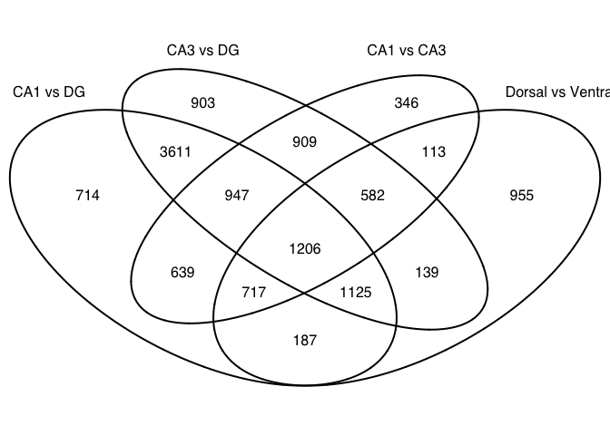

This is for making figures for the cembrowski only

    library(VennDiagram)
    # set output file for figures 
    knitr::opts_chunk$set(fig.path = '../figures/04_Cembrowski/')

    # venn with pvalues
    rldpvals <- read.csv("../results/04_cembrowksi_rldpvals.csv", row.names = 1)

    venn1 <- row.names(rldpvals[rldpvals[1] <0.1 & !is.na(rldpvals[1]),])
    venn2 <- row.names(rldpvals[rldpvals[3] <0.1 & !is.na(rldpvals[3]),])
    venn3 <- row.names(rldpvals[rldpvals[5] <0.1 & !is.na(rldpvals[5]),])
    venn4 <- row.names(rldpvals[rldpvals[7] <0.1 & !is.na(rldpvals[7]),])
    venn12 <- union(venn1,venn2)
    venn123 <- union(venn12,venn3)

    candidates <- list("CA1 vs DG" = venn1, "CA1 vs CA3" = venn3,"CA3 vs DG" = venn2)

    prettyvenn <- venn.diagram(scaled=T,
      x = candidates, filename=NULL, 
      col = "black",
     # fill = c( "white", "white", "white"),
      alpha = 0.5,
      cex = 1, fontfamily = "sans", #fontface = "bold",
      cat.default.pos = "text",
      cat.cex = 1, 
      cat.fontfamily = "sans")
    #dev.off()
    grid.draw(prettyvenn)

    candidates <- list("CA1 vs DG" = venn1, "Dorsal vs Ventral" = venn4,  "CA3 vs DG" = venn2, "CA1 vs CA3" = venn3)

    prettyvenn <- venn.diagram(scaled=T,
      x = candidates, filename=NULL, 
      col = "black",
     # fill = c( "white", "white", "white"),
      alpha = 0.5,
      cex = 1, fontfamily = "sans", #fontface = "bold",
      cat.default.pos = "text",
      cat.cex = 1, 
      cat.fontfamily = "sans")
    #dev.off()
    grid.draw(prettyvenn)

    # save results for meta anlayses
    write(venn123, "../results/04_cembrowski_venn123.txt")
    write(venn4, "../results/04_cembrowski_venn4.txt")
    write(venn1, "../results/04_cembrowski_venn1.txt")
