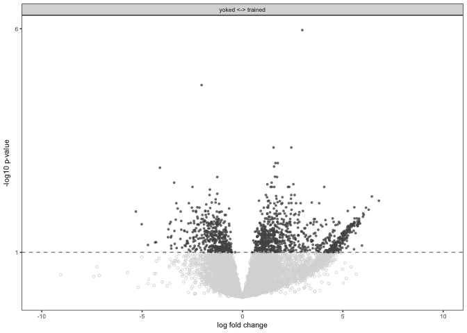
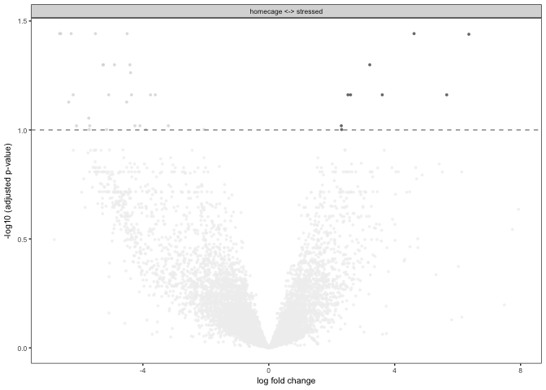
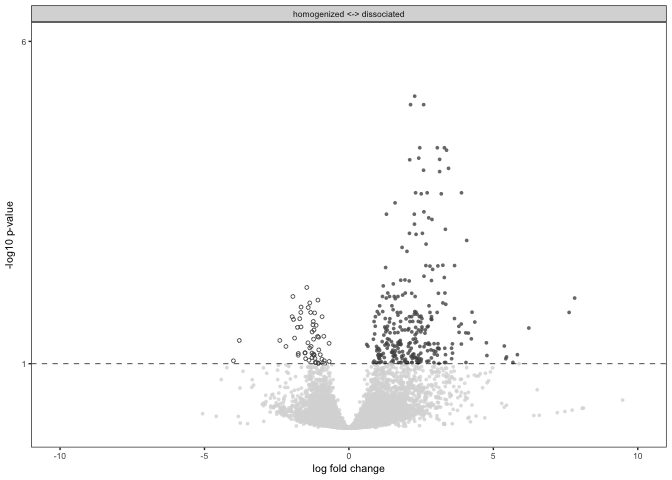
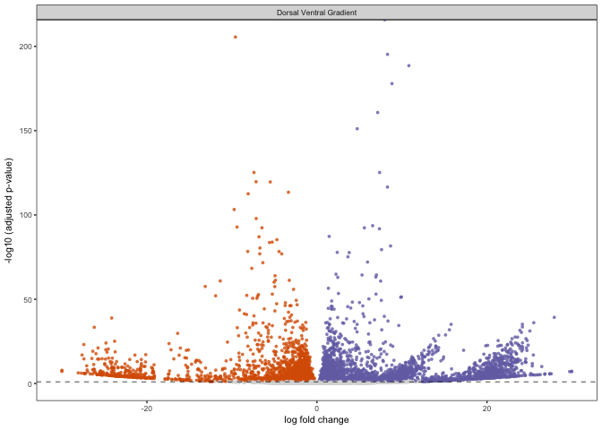
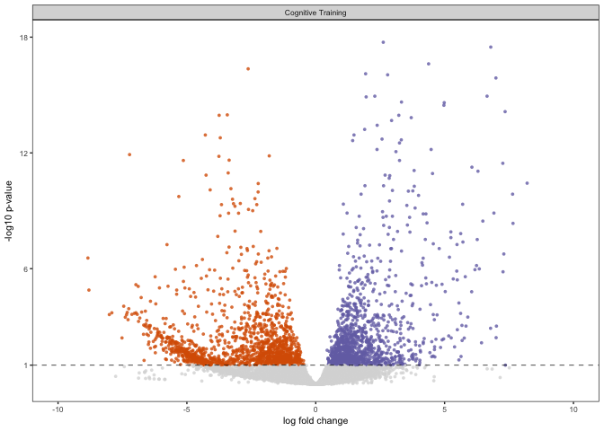
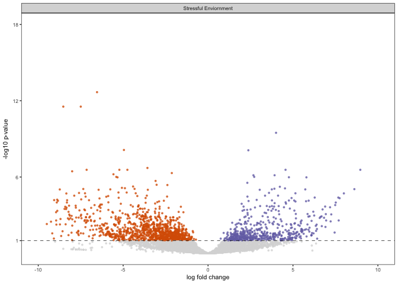
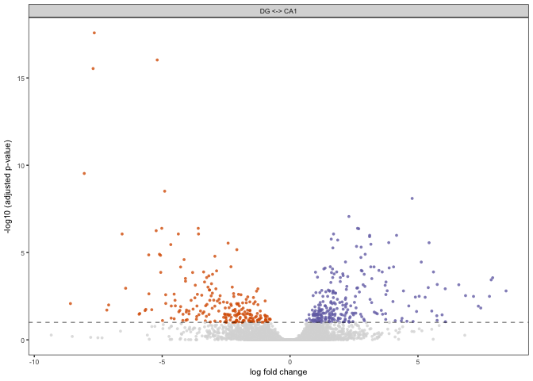

These are the packages I need for my volcano plots.

Here's my function for plotting the effect of treatment. Since each
treatment has different levels, I set the color code outside the
function.

    VolcanoTreatment <- function(filename, colorval){
      data <- filename
      volcanoplot <- ggplot(data, aes(x = lfc, y = pvalue)) + 
      geom_point(aes(color = factor(color), shape = factor(color)), size = 1, alpha = 0.8, na.rm = T) + # add gene points
      theme_bw(base_size = 8) + # clean up theme
      theme(legend.position = "none") + # remove legend 
      scale_color_manual(values = colorval) + theme(panel.grid.minor=element_blank(),
               panel.grid.major=element_blank()) + 
      scale_x_continuous(name="log fold change") +
      scale_y_continuous(name="-log10 (adjusted p-value)") +
      geom_hline(yintercept = 1,  size = 0.25, linetype = 2 ) + 
      scale_shape_manual(values = c(16,16,16)) +
        facet_wrap(~wrap)
      plot(volcanoplot)
      myfile = paste("../figures/volcanoplots/Treatment_", substitute(filename), ".pdf", sep="")
      pdf(file = myfile, width=1.5, height=1.75)
      plot(volcanoplot)
      dev.off()
    }

Now, I load the data and set the color palette.

    cembrowski <- read.csv("../results/04_cembrowski_volcanoTreatment.csv", header = T, row.names = 1)
    cembrowski$wrap <- "Ventral <-> Dorsal"
    cembrowskicolor <- c("ventral" = "#525252", "dorsal" = "#d9d9d9", "none" = "#d9d9d9")

    cognition <- read.csv("../results/03_cognition_volcanoTreatment.csv", header = T, row.names = 1)
    cognition$wrap <- "yoked <-> trained"
    cognitioncolor <-  c("trained" = "#525252", "yoked" = "#d9d9d9", "none" = "#f0f0f0")

    stress <- read.csv("../results/02_stress_volcanoTreatment.csv", header = T, row.names = 1)
    stress$wrap <- "homecage <-> stressed"
    stresscolor <-  c("shocked" = "#525252", "homecage" = "#d9d9d9", "none" = "#f0f0f0")

    dissociation <- read.csv("../results/01_dissociation_volcanoTreatment.csv", header = T, row.names = 1)
    dissociation$wrap <- "homogenized <-> dissociated"
    dissociationcolor <-  c("dissociated" = "#525252", "control" = "#d9d9d9", "none" = "#f0f0f0")

Now, let's run the function on the four files.

    VolcanoTreatment(cembrowski, cembrowskicolor)

    ## quartz_off_screen 
    ##                 2

    VolcanoTreatment(cognition, cognitioncolor)

    ## quartz_off_screen 
    ##                 2

    VolcanoTreatment(stress, stresscolor)

    ## quartz_off_screen 
    ##                 2

    VolcanoTreatment(dissociation, dissociationcolor)

    ## quartz_off_screen 
    ##                 2

Now this is the fucntion for plotting CA1 vs. DG volcano plots. The
color here is set inside.

    VolcanoCA1DG <- function(filename){
      data <- filename
      volcanoplot <- ggplot(data, aes(x = lfc, y = pvalue)) + 
      geom_point(aes(color = factor(color), shape = factor(color)), size = 1, alpha = 0.8, na.rm = T) + # add gene points
      theme_bw(base_size = 8) + # clean up theme
      theme(legend.position = "none") + # remove legend 
      scale_color_manual(values = c("CA1" = "#7570b3",
                                    "DG" = "#d95f02", 
                                    "none" = "#d9d9d9")) + theme(panel.grid.minor=element_blank(),
               panel.grid.major=element_blank()) + 
      scale_x_continuous(name="log fold change") +
      scale_y_continuous(name="-log10 (adjusted p-value)") +
      geom_hline(yintercept = 1,  size = 0.25, linetype = 2 ) + 
      scale_shape_manual(values = c(16,16,16)) +
        facet_wrap(~wrap)
      plot(volcanoplot)
      myfile = paste("../figures/volcanoplots/CA1DG_", substitute(filename), ".pdf", sep="")
      pdf(file = myfile, width=1.5, height=1.75)
      plot(volcanoplot)
      dev.off()
    }

The files

    cembrowski <- read.csv("../results/04_cembrowski_volcanoCA1DG.csv", header = T, row.names = 1)
    cembrowski$wrap <- "Dorsal Ventral Gradient"

    cognition <- read.csv("../results/03_cognition_volcanoCA1DG.csv", header = T, row.names = 1)
    cognition$wrap <- "Cognitive Training"

    stress <- read.csv("../results/02_stress_volcanoCA1DG.csv", header = T, row.names = 1)
    stress$wrap <- "Stressful Enviornment"

    dissociation <- read.csv("../results/01_dissociation_volcanoCA1DG.csv", header = T, row.names = 1)
    dissociation$wrap <- "Cellular Dissociation"

    VolcanoCA1DG(cembrowski)

    ## quartz_off_screen 
    ##                 2

    VolcanoCA1DG(cognition)

    ## quartz_off_screen 
    ##                 2

    VolcanoCA1DG(stress)

    ## quartz_off_screen 
    ##                 2

    VolcanoCA1DG(dissociation)

    ## quartz_off_screen 
    ##                 2
